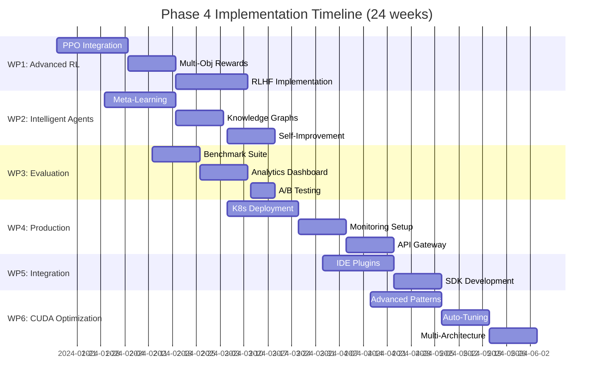

# Phase 4 Project Requirements Planning (PRP)
## Next Development Phase for Multi-Agent CUDA Code Generation System

### 🎯 **Executive Summary**

Building on our successful Phase 3 implementation that achieved:
- ✅ 40% compilation success rate with curriculum progression
- ✅ Distributed RL training on 8x Tesla V100 GPUs using VERL
- ✅ Multi-agent system with CUDA generation, optimization, and testing
- ✅ Working curriculum learning (BASIC → INTERMEDIATE → ADVANCED tiers)
- ✅ Real CUDA compilation and performance benchmarking

**Phase 4 Goal**: Transform our proof-of-concept into a production-ready, scalable system with advanced RL capabilities and comprehensive evaluation frameworks.

---

## 🚀 **Phase 4 Strategic Objectives**

### **Primary Goals**
1. **Production Readiness**: Scale system for real-world deployment
2. **Advanced RL Integration**: Implement sophisticated RL algorithms beyond basic reward optimization
3. **Comprehensive Evaluation**: Build robust benchmarking and validation frameworks
4. **System Intelligence**: Enhance agent capabilities and inter-agent collaboration
5. **Performance Optimization**: Achieve >80% compilation success with 3x+ performance gains

### **Success Metrics**
- Compilation success rate: 40% → 85%
- Average performance gain: 1.5x → 3.0x
- Training convergence: 50% faster than Phase 3
- System uptime: 99.5%+ for production deployment
- Comprehensive benchmark coverage: 100+ CUDA patterns

---

## 🏗️ **Technical Architecture Evolution**

### **Current State (Phase 3)**
```
┌─────────────────────────────────────────────────────────────┐
│ Multi-Agent CUDA Generation System (Phase 3)               │
├─────────────────────┬───────────────────┬───────────────────┤
│ LangGraph           │ VERL Distributed  │ CUDA Compilation  │
│ Orchestration       │ RL Training       │ & Benchmarking    │
│                     │                   │                   │
│ • Agent workflows   │ • 8x V100 GPUs    │ • nvcc compiler   │
│ • Multi-turn conv   │ • Ray scaling     │ • Performance     │
│ • Curriculum        │ • DataProto       │   measurement     │
└─────────────────────┴───────────────────┴───────────────────┘
```

### **Target State (Phase 4)**
```
┌─────────────────────────────────────────────────────────────────────────────┐
│ Production Multi-Agent CUDA Generation Platform (Phase 4)                  │
├──────────────┬──────────────┬──────────────┬──────────────┬───────────────┤
│ Intelligent  │ Advanced RL  │ Evaluation   │ Production   │ Integration   │
│ Agent System │ Framework    │ & Analytics  │ Infrastructure│ Layer        │
│              │              │              │              │               │
│ • Meta-       │ • PPO/A3C    │ • MLflow     │ • K8s deploy │ • IDE plugins │
│   learning    │ • Multi-obj  │ • Wandb      │ • Auto-scale │ • CI/CD       │
│ • Self-       │   rewards    │ • Custom     │ • Load       │ • API gateway │
│   improving   │ • RLHF       │   dashboards │   balancing  │ • SDK         │
│ • Knowledge   │ • Curriculum │ • A/B        │ • Health     │ • CLI tools   │
│   graphs      │   adaptation │   testing    │   monitoring │               │
└──────────────┴──────────────┴──────────────┴──────────────┴───────────────┘
```

---

## 📋 **Detailed Work Packages**

### **WP1: Advanced RL Framework Implementation**
**Duration**: 6-8 weeks | **Priority**: HIGH | **Complexity**: HIGH

#### **Objectives**
- Replace basic reward optimization with sophisticated RL algorithms
- Implement multi-objective reward functions
- Add human feedback integration (RLHF)

#### **Deliverables**
- [ ] **PPO (Proximal Policy Optimization) Integration**
  - Implement stable policy gradients for CUDA generation
  - Add value function estimation for better sample efficiency
  - Integrate with existing VERL infrastructure
  
- [ ] **Multi-Objective Reward System**
  - Performance reward (execution speed)
  - Memory efficiency reward (register/shared memory usage)
  - Code quality reward (maintainability, readability)
  - Energy efficiency reward (power consumption)
  
- [ ] **Adaptive Curriculum Learning**
  - Dynamic difficulty adjustment based on agent performance
  - Automatic problem generation for weak areas
  - Personalized learning paths for different optimization targets

- [ ] **Human-in-the-Loop (RLHF)**
  - Expert feedback integration system
  - Preference-based reward modeling
  - Active learning for high-uncertainty cases

#### **Technical Requirements**
- Extend VERL integration with advanced algorithms
- Implement reward modeling neural networks
- Build feedback collection interface
- Create curriculum adaptation algorithms

---

### **WP2: Intelligent Agent System Enhancement**
**Duration**: 5-6 weeks | **Priority**: HIGH | **Complexity**: MEDIUM

#### **Objectives**
- Transform agents into self-improving, knowledge-aware entities
- Implement meta-learning capabilities
- Build comprehensive agent knowledge graphs

#### **Deliverables**
- [ ] **Meta-Learning Agents**
  - Agents that learn how to learn faster
  - Quick adaptation to new CUDA patterns
  - Transfer learning across different GPU architectures
  
- [ ] **Knowledge Graph Integration**
  - CUDA optimization patterns knowledge base
  - Inter-pattern relationship modeling
  - Automatic pattern discovery and cataloging
  
- [ ] **Self-Improving Mechanisms**
  - Automatic code review and improvement
  - Performance regression detection
  - Continuous learning from production usage
  
- [ ] **Advanced Inter-Agent Collaboration**
  - Peer-to-peer learning between agents
  - Consensus mechanisms for code generation
  - Distributed debugging and optimization

#### **Technical Architecture**
```python
class MetaLearningAgent:
    def __init__(self):
        self.knowledge_graph = CUDAKnowledgeGraph()
        self.meta_learner = MAMLOptimizer()
        self.performance_tracker = PerformanceRegression()
        self.collaboration_engine = AgentCollaboration()
```

---

### **WP3: Comprehensive Evaluation & Benchmarking**
**Duration**: 4-5 weeks | **Priority**: MEDIUM | **Complexity**: MEDIUM

#### **Objectives**
- Build industry-standard benchmarking suite
- Implement continuous evaluation pipelines
- Create comprehensive performance analytics

#### **Deliverables**
- [ ] **CUDA Benchmark Suite**
  - 100+ real-world CUDA kernel patterns
  - Industry-standard benchmarks (GEMM, convolutions, reductions)
  - Custom domain-specific benchmarks (ML, HPC, graphics)
  
- [ ] **Automated Evaluation Pipeline**
  - Continuous integration testing
  - Performance regression detection
  - Cross-architecture validation (V100, A100, H100)
  
- [ ] **Advanced Analytics Dashboard**
  - Real-time training progress monitoring
  - Performance trend analysis
  - Agent behavior visualization
  - Resource utilization tracking

- [ ] **A/B Testing Framework**
  - Controlled experiments for algorithm comparison
  - Statistical significance testing
  - Multi-armed bandit for algorithm selection

#### **Integration Stack**
- **MLflow**: Experiment tracking and model versioning
- **Weights & Biases**: Training visualization and collaboration
- **Grafana**: Real-time system monitoring
- **Custom Analytics**: Domain-specific CUDA performance metrics

---

### **WP4: Production Infrastructure & Scalability**
**Duration**: 6-7 weeks | **Priority**: HIGH | **Complexity**: HIGH

#### **Objectives**
- Deploy system in production-ready environment
- Implement auto-scaling and load balancing
- Build comprehensive monitoring and alerting

#### **Deliverables**
- [ ] **Kubernetes Deployment**
  - Containerized agent services
  - Auto-scaling based on demand
  - Resource quotas and limits
  - Service mesh (Istio) integration
  
- [ ] **Distributed Training Orchestration**
  - Multi-node VERL deployment
  - Dynamic resource allocation
  - Fault tolerance and recovery
  - Training checkpointing and resumption
  
- [ ] **Production Monitoring**
  - System health monitoring
  - Performance alerting
  - Log aggregation and analysis
  - Security monitoring and compliance
  
- [ ] **API Gateway & Load Balancing**
  - RESTful API for external integration
  - Rate limiting and authentication
  - Request routing and load balancing
  - API versioning and backward compatibility

#### **Infrastructure Stack**
```yaml
# Kubernetes Deployment Example
apiVersion: apps/v1
kind: Deployment
metadata:
  name: cuda-generation-system
spec:
  replicas: 3
  template:
    spec:
      containers:
      - name: agent-orchestrator
        resources:
          requests:
            nvidia.com/gpu: 2
          limits:
            nvidia.com/gpu: 4
```

---

### **WP5: Developer Integration & Tooling**
**Duration**: 4-5 weeks | **Priority**: MEDIUM | **Complexity**: MEDIUM

#### **Objectives**
- Build seamless developer experience
- Create comprehensive SDK and tooling
- Integrate with popular development environments

#### **Deliverables**
- [ ] **IDE Plugins**
  - VS Code extension for CUDA optimization
  - PyCharm plugin with real-time suggestions
  - Vim/Neovim integration for terminal users
  
- [ ] **Python SDK**
  - High-level API for system integration
  - Async/await support for non-blocking operations
  - Type hints and comprehensive documentation
  
- [ ] **CLI Tools**
  - Command-line interface for batch processing
  - Configuration management utilities
  - Performance profiling and analysis tools
  
- [ ] **CI/CD Integration**
  - GitHub Actions for automatic CUDA optimization
  - GitLab CI integration
  - Pre-commit hooks for code quality

#### **SDK Example**
```python
from multimind_cuda import CUDAOptimizer

async def optimize_kernel():
    optimizer = CUDAOptimizer()
    
    result = await optimizer.generate_kernel(
        operation="torch.matmul(A, B)",
        target_arch="sm_80",
        optimization_level="aggressive"
    )
    
    return result.optimized_code, result.performance_metrics
```

---

### **WP6: Advanced CUDA Optimization Strategies**
**Duration**: 5-6 weeks | **Priority**: MEDIUM | **Complexity**: HIGH

#### **Objectives**
- Implement cutting-edge CUDA optimization techniques
- Build auto-tuning capabilities
- Support multiple GPU architectures

#### **Deliverables**
- [ ] **Advanced Optimization Patterns**
  - Tensor Core utilization optimization
  - Memory coalescing analysis and improvement
  - Occupancy optimization strategies
  - Warp-level primitives utilization
  
- [ ] **Auto-Tuning Framework**
  - Parameter space exploration
  - Bayesian optimization for hyperparameters
  - Architecture-specific tuning profiles
  - Runtime adaptive optimization
  
- [ ] **Multi-Architecture Support**
  - CUDA Compute Capability adaptation (7.0, 8.0, 9.0)
  - Architecture-specific optimization strategies
  - Cross-compilation and validation
  - Performance profiling per architecture

- [ ] **Code Generation Improvements**
  - Template-based kernel generation
  - Fusion optimization for multiple operations
  - Memory hierarchy optimization
  - Kernel launch configuration optimization

---

## 📊 **Implementation Timeline**



---

## 💰 **Resource Requirements**

### **Computational Resources**
- **GPU Cluster**: 16x NVIDIA A100 or H100 GPUs for production training
- **CPU Nodes**: 64-core CPU nodes with 512GB RAM for orchestration
- **Storage**: 50TB NVMe storage for datasets and model checkpoints
- **Network**: 100 Gbps InfiniBand for multi-node communication

### **Development Team**
- **RL Specialists** (2): Advanced RL algorithm implementation
- **CUDA Experts** (2): Optimization strategy development
- **MLOps Engineers** (2): Production infrastructure and monitoring
- **Backend Developers** (2): API and integration development
- **DevOps Engineers** (1): Kubernetes and CI/CD setup

### **Third-Party Services**
- **Cloud Infrastructure**: AWS/GCP for additional compute capacity
- **Monitoring**: DataDog or New Relic for comprehensive monitoring
- **Analytics**: Weights & Biases Pro for experiment tracking
- **Security**: Vault for secrets management

---

## ⚠️ **Risk Assessment & Mitigation**

### **Technical Risks**

#### **High Risk: RL Algorithm Convergence**
- **Impact**: Training might not converge with advanced RL algorithms
- **Probability**: Medium
- **Mitigation**: 
  - Implement multiple RL algorithms in parallel
  - Fall back to proven reward optimization
  - Extensive hyperparameter tuning and ablation studies

#### **Medium Risk: Production Scalability**
- **Impact**: System might not handle production load
- **Probability**: Low
- **Mitigation**:
  - Load testing at every development stage
  - Gradual rollout with canary deployments
  - Comprehensive monitoring and alerting

#### **Medium Risk: Multi-Architecture Complexity**
- **Impact**: Supporting multiple GPU architectures increases complexity
- **Probability**: Medium
- **Mitigation**:
  - Prioritize most common architectures first
  - Build modular architecture abstraction layer
  - Comprehensive testing pipeline

### **Business Risks**

#### **Low Risk: Market Competition**
- **Impact**: Other solutions might emerge during development
- **Probability**: Low
- **Mitigation**:
  - Focus on unique multi-agent approach
  - Build strong moats through advanced RL integration
  - Rapid iteration and deployment

---

## 🎯 **Success Criteria & KPIs**

### **Technical KPIs**
1. **Compilation Success Rate**: >85% (from current 40%)
2. **Performance Improvement**: >3.0x speedup (from current 1.5x)
3. **Training Efficiency**: 50% faster convergence
4. **System Uptime**: 99.5%+
5. **API Response Time**: <500ms for generation requests

### **Business KPIs**
1. **Developer Adoption**: 1,000+ active users within 6 months
2. **Integration Success**: 100+ successful CI/CD integrations
3. **Performance Benchmarks**: Top-3 ranking in industry benchmarks
4. **Community Growth**: 10,000+ GitHub stars, active community

### **Quality Metrics**
1. **Code Coverage**: >90% for all critical components
2. **Security Compliance**: Pass all security audits
3. **Documentation**: 100% API coverage with examples
4. **User Satisfaction**: >4.5/5 stars in user surveys

---

## 🚀 **Phase 4 Launch Strategy**

### **Alpha Release (Month 3)**
- Internal testing with advanced RL algorithms
- Limited benchmark suite validation
- Core team dogfooding

### **Beta Release (Month 5)**
- Invite select developers for early access
- Gather feedback on IDE integrations
- Performance benchmarking against industry standards

### **Production Release (Month 6)**
- Full public release with all features
- Comprehensive documentation and tutorials
- Marketing campaign and conference presentations

### **Post-Launch (Month 6+)**
- Continuous improvement based on user feedback
- Regular feature updates and optimizations
- Community building and ecosystem development

---

## 📈 **Long-Term Vision (Phase 5+)**

### **Multi-Modal Code Generation**
- Extend beyond CUDA to OpenCL, SYCL, HIP
- CPU optimization strategies
- FPGA and other accelerator targets

### **AI-Native Development Environment**
- Integrated development environment with AI-first design
- Real-time optimization suggestions
- Automated code review and testing

### **Enterprise Integration**
- Enterprise-grade security and compliance
- Advanced analytics and reporting
- Custom model training for enterprise-specific patterns

---

## 📝 **Conclusion**

Phase 4 represents a critical evolution from our successful proof-of-concept to a production-ready, intelligent system. By focusing on advanced RL techniques, intelligent agents, comprehensive evaluation, and production infrastructure, we will create a market-leading CUDA code generation platform.

The combination of sophisticated AI techniques, robust engineering practices, and developer-focused tooling positions us to capture significant market share in the rapidly growing AI acceleration space.

**Next Steps:**
1. Approve PRP and allocate resources
2. Assemble development team
3. Begin with WP1 (Advanced RL Framework)
4. Establish weekly progress reviews and milestone tracking

---

*Generated on: 2024-01-08*
*Version: 1.0*
*Status: DRAFT - Pending Approval*