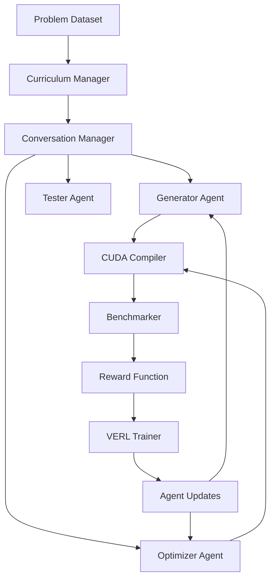

# CUDA Multi-Agent RL Training System
## Complete Technical Specification & Implementation Guide

---

## Table of Contents

1. [System Architecture](#system-architecture)
2. [Core Components](#core-components)
3. [Implementation Details](#implementation-details)
4. [Integration Strategies](#integration-strategies)
5. [Training Pipeline](#training-pipeline)
6. [Safety & Security](#safety--security)
7. [Performance Optimization](#performance-optimization)
8. [Gotchas & Common Pitfalls](#gotchas--common-pitfalls)
9. [Deployment Guide](#deployment-guide)
10. [Troubleshooting](#troubleshooting)

---

## System Architecture

### High-Level Design Philosophy

The system implements a **hybrid learning paradigm** combining Supervised Fine-Tuning (SFT) with Multi-Turn Reinforcement Learning (RL) for CUDA code generation and optimization. The architecture follows a **specialist agent approach** where each agent has distinct responsibilities:

- **Generator Agent**: Creates initial CUDA implementations from problem descriptions
- **Optimizer Agent**: Applies performance optimizations to existing kernels
- **Tester Agent**: Validates correctness and measures performance

### Data Flow Architecture



### Component Interaction Matrix

| Component | Interfaces With | Data Exchange | Purpose |
|-----------|----------------|---------------|---------|
| Curriculum Manager | Data Pipeline, Conversation Manager | Problem filtering, difficulty progression | Progressive skill building |
| Conversation Manager | All Agents, Reward System | Turn sequences, state management | Multi-turn coordination |
| CUDA Compiler | All Agents, Safety Wrapper | Source code, compilation results | Code validation |
| Benchmarker | Compiler, Reward Function | Performance metrics, correctness | Performance measurement |
| VERL Trainer | Agents, Reward Function | Gradients, policy updates | Distributed RL training |

---

## Core Components

### 1. CUDA Compilation Infrastructure

#### Real Compilation Implementation

```python
# src/coding_framework/cuda/compiler.py

import asyncio
import subprocess
import tempfile
import os
import time
import re
from typing import Dict, List, Optional, Tuple
from dataclasses import dataclass
from pathlib import Path
import structlog

@dataclass
class CompilationResult:
    """Enhanced compilation result with metrics for reward calculation."""
    success: bool
    binary_path: Optional[str] = None
    stdout: str = ""
    stderr: str = ""
    compilation_time: float = 0.0
    kernel_name: str = ""
    
    # CUDA-specific metrics
    register_pressure: int = 0  # Registers per thread
    shared_memory_usage: int = 0  # Bytes of shared memory
    compilation_warnings: List[str] = None
    ptx_code: Optional[str] = None
    resource_usage: Dict = None
    temp_files: List[str] = None

class CUDACompiler:
    """Production CUDA compiler with Docker safety and comprehensive metrics."""
    
    def __init__(
        self,
        nvcc_path: str = "nvcc",
        cuda_arch: str = "auto",
        optimization_level: str = "-O3",
        temp_dir: Optional[str] = None,
        use_docker: bool = True,
        docker_image: str = "nvidia/cuda:12.0-devel-ubuntu20.04"
    ):
        self.nvcc_path = nvcc_path
        self.cuda_arch = cuda_arch
        self.optimization_level = optimization_level
        self.temp_dir = temp_dir or tempfile.mkdtemp(prefix="cuda_compiler_")
        self.use_docker = use_docker
        self.docker_image = docker_image
        self.logger = structlog.get_logger()
        
        # Validate environment
        self._validate_environment()
    
    def _validate_environment(self):
        """Validate CUDA and Docker environment."""
        if self.use_docker:
            if not self._check_docker_available():
                raise RuntimeError("Docker not available but use_docker=True")
            if not self._check_docker_gpu_support():
                self.logger.warning("Docker GPU support not detected")
        else:
            if not self._check_nvcc_available():
                raise RuntimeError(f"nvcc not found at {self.nvcc_path}")
    
    def _check_docker_available(self) -> bool:
        """Check if Docker is available and running."""
        try:
            result = subprocess.run(
                ["docker", "info"], 
                capture_output=True, 
                text=True, 
                timeout=10
            )
            return result.returncode == 0
        except (subprocess.TimeoutExpired, FileNotFoundError):
            return False
    
    def _check_docker_gpu_support(self) -> bool:
        """Check if Docker supports GPU access."""
        try:
            result = subprocess.run(
                ["docker", "run", "--rm", "--gpus=all", "nvidia/cuda:12.0-base-ubuntu20.04", "nvidia-smi"],
                capture_output=True,
                text=True,
                timeout=30
            )
            return result.returncode == 0
        except (subprocess.TimeoutExpired, FileNotFoundError):
            return False
    
    def _check_nvcc_available(self) -> bool:
        """Check if nvcc is available."""
        try:
            result = subprocess.run(
                [self.nvcc_path, "--version"],
                capture_output=True,
                text=True,
                timeout=10
            )
            return result.returncode == 0
        except (subprocess.TimeoutExpired, FileNotFoundError):
            return False
    
    def detect_gpu_architecture(self) -> str:
        """Detect GPU architecture for compilation."""
        if self.cuda_arch != "auto":
            return self.cuda_arch
            
        try:
            # Use nvidia-ml-py or nvidia-smi to detect architecture
            result = subprocess.run(
                ["nvidia-smi", "--query-gpu=compute_cap", "--format=csv,noheader,nounits"],
                capture_output=True,
                text=True,
                timeout=10
            )
            
            if result.returncode == 0:
                compute_cap = result.stdout.strip().split('\n')[0]
                major, minor = compute_cap.split('.')
                return f"sm_{major}{minor}"
            else:
                self.logger.warning("Could not detect GPU architecture, using sm_75")
                return "sm_75"
                
        except Exception as e:
            self.logger.warning(f"GPU architecture detection failed: {e}, using sm_75")
            return "sm_75"
    
    async def compile_kernel(
        self,
        kernel_code: str,
        kernel_name: str = "kernel",
        additional_flags: Optional[List[str]] = None,
        include_dirs: Optional[List[str]] = None
    ) -> CompilationResult:
        """Compile CUDA kernel with comprehensive error handling and metrics."""
        
        if self.use_docker:
            return await self._compile_in_docker(kernel_code, kernel_name, additional_flags)
        else:
            return await self._compile_native(kernel_code, kernel_name, additional_flags)
    
    async def _compile_in_docker(
        self,
        kernel_code: str,
        kernel_name: str,
        additional_flags: Optional[List[str]] = None
    ) -> CompilationResult:
        """Compile CUDA kernel in Docker container for maximum safety."""
        start_time = time.time()
        
        try:
            # Create container-specific temp directory
            container_temp_dir = os.path.join(self.temp_dir, f"container_{kernel_name}_{int(time.time())}")
            os.makedirs(container_temp_dir, exist_ok=True)
            
            # Wrap kernel code with necessary includes and wrapper
            full_kernel_code = self._wrap_kernel_code(kernel_code, kernel_name)
            
            # Write kernel to file
            kernel_file = os.path.join(container_temp_dir, f"{kernel_name}.cu")
            with open(kernel_file, 'w') as f:
                f.write(full_kernel_code)
            
            # Detect GPU architecture
            arch = self.detect_gpu_architecture()
            
            # Build Docker compilation command
            docker_cmd = [
                "docker", "run", "--rm",
                "--gpus=all",  # Enable GPU access
                "--memory=8g",  # Memory limit
                "--cpus=4.0",   # CPU limit
                "--network=none",  # No network access for security
                f"--volume={container_temp_dir}:/workspace:rw",
                "--workdir=/workspace",
                "--user=root",  # Needed for file permissions
                self.docker_image,
                "bash", "-c", f"""
                    set -e
                    nvcc {self.optimization_level} -arch={arch} \
                         -shared -Xcompiler -fPIC \
                         --ptxas-options=-v \
                         -o {kernel_name}.so {kernel_name}.cu 2>&1
                """
            ]
            
            # Add additional flags if provided
            if additional_flags:
                # Insert additional flags before the output specification
                insert_index = docker_cmd.index("bash") + 2
                cmd_str = docker_cmd[insert_index]
                cmd_str = cmd_str.replace(f"-o {kernel_name}.so", f"{' '.join(additional_flags)} -o {kernel_name}.so")
                docker_cmd[insert_index] = cmd_str
            
            # Execute compilation with timeout
            process = await asyncio.create_subprocess_exec(
                *docker_cmd,
                stdout=asyncio.subprocess.PIPE,
                stderr=asyncio.subprocess.PIPE
            )
            
            try:
                stdout, stderr = await asyncio.wait_for(
                    process.communicate(),
                    timeout=60.0  # 60 second timeout
                )
                
                stdout_text = stdout.decode('utf-8') if stdout else ""
                stderr_text = stderr.decode('utf-8') if stderr else ""
                
            except asyncio.TimeoutError:
                process.kill()
                await process.wait()
                compilation_time = time.time() - start_time
                
                return CompilationResult(
                    success=False,
                    stderr="Compilation timeout after 60 seconds",
                    compilation_time=compilation_time,
                    kernel_name=kernel_name
                )
            
            success = process.returncode == 0
            compilation_time = time.time() - start_time
            
            # Extract CUDA-specific metrics from compilation output
            register_pressure = self._extract_register_pressure(stderr_text)
            shared_memory_usage = self._extract_shared_memory_usage(stderr_text)
            warnings = self._parse_compilation_warnings(stderr_text)
            
            # Set binary path if compilation succeeded
            binary_path = None
            if success:
                binary_path = os.path.join(container_temp_dir, f"{kernel_name}.so")
                if not os.path.exists(binary_path):
                    success = False
                    stderr_text += "\nERROR: Binary file was not created"
            
            self.logger.info(
                "Docker CUDA compilation completed",
                kernel_name=kernel_name,
                success=success,
                compilation_time=compilation_time,
                register_pressure=register_pressure,
                shared_memory_usage=shared_memory_usage,
                warnings_count=len(warnings)
            )
            
            return CompilationResult(
                success=success,
                binary_path=binary_path,
                stdout=stdout_text,
                stderr=stderr_text,
                compilation_time=compilation_time,
                kernel_name=kernel_name,
                register_pressure=register_pressure,
                shared_memory_usage=shared_memory_usage,
                compilation_warnings=warnings,
                temp_files=[kernel_file, binary_path] if binary_path else [kernel_file],
                resource_usage={
                    "compilation_method": "docker",
                    "cuda_arch": arch,
                    "container_timeout": 60,
                    "memory_limit": "8g",
                    "cpu_limit": "4.0"
                }
            )
            
        except Exception as e:
            compilation_time = time.time() - start_time
            error_msg = f"Docker compilation error: {str(e)}"
            
            self.logger.error(
                "Docker CUDA compilation failed",
                kernel_name=kernel_name,
                error=error_msg,
                compilation_time=compilation_time
            )
            
            return CompilationResult(
                success=False,
                stderr=error_msg,
                compilation_time=compilation_time,
                kernel_name=kernel_name
            )
    
    def _wrap_kernel_code(self, kernel_code: str, kernel_name: str) -> str:
        """Wrap user kernel code with necessary includes and launch wrapper."""
        
        # Basic includes
        includes = """
#include <cuda_runtime.h>
#include <stdio.h>
#include <stdlib.h>

// Error checking macro
#define CUDA_CHECK(call) do { \\
    cudaError_t err = call; \\
    if (err != cudaSuccess) { \\
        fprintf(stderr, "CUDA error at %s:%d - %s\\n", __FILE__, __LINE__, cudaGetErrorString(err)); \\
        exit(1); \\
    } \\
} while(0)

"""
        
        # Extract kernel function name from code (simple regex)
        kernel_match = re.search(r'__global__\s+\w+\s+(\w+)\s*\(', kernel_code)
        actual_kernel_name = kernel_match.group(1) if kernel_match else "unknown_kernel"
        
        # Create C wrapper for easier calling from Python
        wrapper_code = f"""

// C wrapper for Python ctypes interface
extern "C" {{
    void launch_{kernel_name}(void** args, int num_args, dim3 grid, dim3 block, size_t shared_mem) {{
        // This is a simplified launcher - in practice you'd need more sophisticated parameter handling
        switch(num_args) {{
            case 3:
                {actual_kernel_name}<<<grid, block, shared_mem>>>((float*)args[0], (float*)args[1], (float*)args[2]);
                break;
            case 4:
                {actual_kernel_name}<<<grid, block, shared_mem>>>((float*)args[0], (float*)args[1], (float*)args[2], *(int*)args[3]);
                break;
            // Add more cases as needed
            default:
                fprintf(stderr, "Unsupported number of arguments: %d\\n", num_args);
        }}
        CUDA_CHECK(cudaGetLastError());
        CUDA_CHECK(cudaDeviceSynchronize());
    }}
}}
"""
        
        return includes + kernel_code + wrapper_code
    
    def _extract_register_pressure(self, compilation_output: str) -> int:
        """Extract register usage from nvcc compilation output."""
        # Look for ptxas info about register usage
        register_match = re.search(r'(\d+) registers', compilation_output)
        if register_match:
            return int(register_match.group(1))
        return 0
    
    def _extract_shared_memory_usage(self, compilation_output: str) -> int:
        """Extract shared memory usage from compilation output."""
        # Look for shared memory usage info
        smem_match = re.search(r'(\d+) bytes smem', compilation_output)
        if smem_match:
            return int(smem_match.group(1))
        return 0
    
    def _parse_compilation_warnings(self, compilation_output: str) -> List[str]:
        """Parse compilation warnings from nvcc output."""
        warnings = []
        lines = compilation_output.split('\n')
        
        for line in lines:
            line = line.strip()
            if 'warning:' in line.lower():
                warnings.append(line)
            elif 'note:' in line.lower() and 'optimization' in line.lower():
                warnings.append(line)
        
        return warnings
    
    def cleanup_temp_files(self, compilation_result: CompilationResult):
        """Clean up temporary files created during compilation."""
        if compilation_result.temp_files:
            for temp_file in compilation_result.temp_files:
                try:
                    if temp_file and os.path.exists(temp_file):
                        os.remove(temp_file)
                        self.logger.debug(f"Cleaned up temp file: {temp_file}")
                except Exception as e:
                    self.logger.warning(f"Failed to clean up {temp_file}: {e}")
```

#### Comprehensive Benchmarking System

```python
# src/coding_framework/cuda/benchmarker.py

import ctypes
import time
import statistics
from typing import List, Dict, Any, Tuple, Optional
import torch
import numpy as np
from dataclasses import dataclass
import structlog

@dataclass
class BenchmarkResult:
    """Comprehensive benchmark results with multiple performance metrics."""
    success: bool
    execution_time_ms: float = 0.0
    memory_bandwidth_gb_s: float = 0.0
    compute_throughput_gflops: float = 0.0
    gpu_utilization_percent: float = 0.0
    
    # Correctness metrics
    functional_correct: bool = False
    numerical_accuracy: float = 0.0  # For floating point operations
    
    # Performance comparisons
    speedup_vs_baseline: float = 1.0
    speedup_vs_torch: float = 1.0
    
    # Resource utilization
    peak_memory_usage_mb: float = 0.0
    occupancy_percent: float = 0.0
    
    # Error information
    error_message: str = ""
    benchmark_details: Dict[str, Any] = None

class CUDABenchmarker:
    """Production CUDA kernel benchmarker with comprehensive metrics."""
    
    def __init__(
        self,
        warmup_iterations: int = 3,
        benchmark_iterations: int = 10,
        memory_check_tolerance: float = 1e-5
    ):
        self.warmup_iterations = warmup_iterations
        self.benchmark_iterations = benchmark_iterations
        self.memory_check_tolerance = memory_check_tolerance
        self.logger = structlog.get_logger()
        
        # Initialize CUDA context
        self._initialize_cuda_context()
    
    def _initialize_cuda_context(self):
        """Initialize CUDA context and check GPU availability."""
        if not torch.cuda.is_available():
            raise RuntimeError("CUDA not available for benchmarking")
        
        self.device = torch.cuda.current_device()
        self.device_props = torch.cuda.get_device_properties(self.device)
        
        self.logger.info(
            "CUDA benchmarker initialized",
            device=self.device,
            device_name=self.device_props.name,
            compute_capability=f"{self.device_props.major}.{self.device_props.minor}",
            total_memory_gb=self.device_props.total_memory / (1024**3)
        )
    
    async def benchmark_kernel(
        self,
        binary_path: str,
        kernel_name: str,
        test_cases: List[Dict[str, Any]],
        baseline_implementation: Optional[callable] = None
    ) -> BenchmarkResult:
        """
        Benchmark CUDA kernel against test cases with comprehensive metrics.
        
        Args:
            binary_path: Path to compiled kernel shared library
            kernel_name: Name of the kernel function
            test_cases: List of test case specifications
            baseline_implementation: Optional baseline for speedup comparison
            
        Returns:
            BenchmarkResult with comprehensive performance metrics
        """
        
        try:
            # Load compiled kernel
            kernel_lib = ctypes.CDLL(binary_path)
            launch_func = getattr(kernel_lib, f"launch_{kernel_name}")
            
            # Configure function signature
            launch_func.argtypes = [
                ctypes.POINTER(ctypes.c_void_p),  # args array
                ctypes.c_int,                     # num_args
                ctypes.c_uint, ctypes.c_uint, ctypes.c_uint,  # grid dims
                ctypes.c_uint, ctypes.c_uint, ctypes.c_uint,  # block dims
                ctypes.c_size_t                   # shared memory
            ]
            launch_func.restype = None
            
            # Run benchmarks on all test cases
            all_results = []
            
            for i, test_case in enumerate(test_cases):
                self.logger.debug(f"Running benchmark for test case {i+1}/{len(test_cases)}")
                
                case_result = await self._benchmark_single_case(
                    launch_func, test_case, baseline_implementation
                )
                all_results.append(case_result)
            
            # Aggregate results
            return self._aggregate_benchmark_results(all_results)
            
        except Exception as e:
            error_msg = f"Benchmark failed: {str(e)}"
            self.logger.error("Kernel benchmark failed", error=error_msg)
            
            return BenchmarkResult(
                success=False,
                error_message=error_msg
            )
    
    async def _benchmark_single_case(
        self,
        launch_func: ctypes.CFUNCTYPE,
        test_case: Dict[str, Any],
        baseline_implementation: Optional[callable] = None
    ) -> BenchmarkResult:
        """Benchmark kernel on a single test case."""
        
        # Extract test case parameters
        input_shapes = test_case.get("input_shapes", [[1024]])
        data_type = test_case.get("dtype", torch.float32)
        grid_dims = test_case.get("grid_dims", (32, 1, 1))
        block_dims = test_case.get("block_dims", (256, 1, 1))
        shared_memory = test_case.get("shared_memory", 0)
        
        # Generate test data
        gpu_inputs, expected_output = self._generate_test_data(input_shapes, data_type)
        gpu_output = torch.zeros_like(expected_output)
        
        # Prepare arguments for kernel launch
        args_array = self._prepare_kernel_args(gpu_inputs + [gpu_output])
        
        # Warmup runs
        for _ in range(self.warmup_iterations):
            try:
                launch_func(
                    args_array, len(gpu_inputs) + 1,
                    grid_dims[0], grid_dims[1], grid_dims[2],
                    block_dims[0], block_dims[1], block_dims[2],
                    shared_memory
                )
                torch.cuda.synchronize()
            except Exception as e:
                return BenchmarkResult(
                    success=False,
                    error_message=f"Warmup failed: {str(e)}"
                )
        
        # Benchmark runs with timing
        execution_times = []
        memory_stats = []
        
        for iteration in range(self.benchmark_iterations):
            # Reset output
            gpu_output.zero_()
            
            # Record memory before execution
            torch.cuda.empty_cache()
            memory_before = torch.cuda.memory_allocated(self.device)
            
            # Time execution
            torch.cuda.synchronize()
            start_event = torch.cuda.Event(enable_timing=True)
            end_event = torch.cuda.Event(enable_timing=True)
            
            start_event.record()
            
            try:
                launch_func(
                    args_array, len(gpu_inputs) + 1,
                    grid_dims[0], grid_dims[1], grid_dims[2],
                    block_dims[0], block_dims[1], block_dims[2],
                    shared_memory
                )
            except Exception as e:
                return BenchmarkResult(
                    success=False,
                    error_message=f"Kernel execution failed on iteration {iteration}: {str(e)}"
                )
            
            end_event.record()
            torch.cuda.synchronize()
            
            # Record metrics
            execution_time_ms = start_event.elapsed_time(end_event)
            memory_after = torch.cuda.memory_allocated(self.device)
            
            execution_times.append(execution_time_ms)
            memory_stats.append(memory_after - memory_before)
        
        # Verify correctness
        functional_correct, numerical_accuracy = self._verify_correctness(
            gpu_output.cpu(), expected_output.cpu()
        )
        
        if not functional_correct:
            return BenchmarkResult(
                success=False,
                functional_correct=False,
                error_message="Kernel output does not match expected result"
            )
        
        # Calculate performance metrics
        avg_execution_time = statistics.mean(execution_times)
        
        # Memory bandwidth calculation (simplified)
        total_bytes = sum(tensor.numel() * tensor.element_size() for tensor in gpu_inputs + [gpu_output])
        memory_bandwidth = (total_bytes / (1024**3)) / (avg_execution_time / 1000)  # GB/s
        
        # Calculate speedup vs baseline if provided
        speedup_vs_baseline = 1.0
        if baseline_implementation:
            baseline_time = self._benchmark_baseline(baseline_implementation, gpu_inputs, expected_output)
            if baseline_time > 0:
                speedup_vs_baseline = baseline_time / avg_execution_time
        
        # Calculate speedup vs PyTorch equivalent
        speedup_vs_torch = self._benchmark_torch_equivalent(gpu_inputs, expected_output, avg_execution_time)
        
        return BenchmarkResult(
            success=True,
            execution_time_ms=avg_execution_time,
            memory_bandwidth_gb_s=memory_bandwidth,
            functional_correct=functional_correct,
            numerical_accuracy=numerical_accuracy,
            speedup_vs_baseline=speedup_vs_baseline,
            speedup_vs_torch=speedup_vs_torch,
            peak_memory_usage_mb=max(memory_stats) / (1024**2),
            benchmark_details={
                "execution_times": execution_times,
                "memory_usage": memory_stats,
                "test_case_params": test_case,
                "total_data_bytes": total_bytes
            }
        )
    
    def _generate_test_data(
        self, 
        input_shapes: List[List[int]], 
        data_type: torch.dtype
    ) -> Tuple[List[torch.Tensor], torch.Tensor]:
        """Generate test input data and expected output."""
        
        # Generate random input tensors
        gpu_inputs = []
        for shape in input_shapes:
            tensor = torch.randn(shape, dtype=data_type, device='cuda')
            gpu_inputs.append(tensor)
        
        # For simple operations, calculate expected output
        # This is a simplified version - real implementation would need
        # to understand the kernel's intended operation
        if len(gpu_inputs) == 2 and gpu_inputs[0].shape == gpu_inputs[1].shape:
            # Assume element-wise addition as default
            expected_output = gpu_inputs[0] + gpu_inputs[1]
        else:
            # For more complex operations, you'd need problem-specific logic
            expected_output = torch.zeros_like(gpu_inputs[0])
        
        return gpu_inputs, expected_output
    
    def _prepare_kernel_args(self, tensors: List[torch.Tensor]) -> ctypes.Array:
        """Prepare tensor arguments for kernel launch."""
        args = []
        for tensor in tensors:
            # Get raw data pointer as void*
            ptr = ctypes.cast(tensor.data_ptr(), ctypes.c_void_p)
            args.append(ptr)
        
        # Create array of void pointers
        args_array_type = ctypes.c_void_p * len(args)
        return args_array_type(*args)
    
    def _verify_correctness(
        self, 
        actual: torch.Tensor, 
        expected: torch.Tensor
    ) -> Tuple[bool, float]:
        """Verify functional correctness and calculate numerical accuracy."""
        
        if actual.shape != expected.shape:
            return False, 0.0
        
        # Check for exact equality first (for integer operations)
        if torch.equal(actual, expected):
            return True, 1.0
        
        # For floating point, check relative tolerance
        if actual.dtype.is_floating_point:
            abs_diff = torch.abs(actual - expected)
            rel_diff = abs_diff / (torch.abs(expected) + 1e-8)
            
            max_abs_error = torch.max(abs_diff).item()
            max_rel_error = torch.max(rel_diff).item()
            
            # Consider correct if relative error is within tolerance
            is_correct = max_rel_error < self.memory_check_tolerance
            
            # Accuracy score based on how many elements are within tolerance
            within_tolerance = rel_diff < self.memory_check_tolerance
            accuracy = torch.sum(within_tolerance).item() / actual.numel()
            
            return is_correct, accuracy
        else:
            # For integer types, require exact match
            return torch.equal(actual, expected), 1.0 if torch.equal(actual, expected) else 0.0
    
    def _benchmark_baseline(
        self, 
        baseline_func: callable, 
        inputs: List[torch.Tensor], 
        expected_output: torch.Tensor
    ) -> float:
        """Benchmark baseline implementation for speedup comparison."""
        try:
            # Warmup
            for _ in range(self.warmup_iterations):
                baseline_func(*inputs)
                torch.cuda.synchronize()
            
            # Benchmark
            torch.cuda.synchronize()
            start_time = time.time()
            
            for _ in range(self.benchmark_iterations):
                baseline_func(*inputs)
            
            torch.cuda.synchronize()
            end_time = time.time()
            
            avg_time_ms = ((end_time - start_time) / self.benchmark_iterations) * 1000
            return avg_time_ms
            
        except Exception as e:
            self.logger.warning(f"Baseline benchmark failed: {e}")
            return 0.0
    
    def _benchmark_torch_equivalent(
        self, 
        inputs: List[torch.Tensor], 
        expected_output: torch.Tensor,
        kernel_time_ms: float
    ) -> float:
        """Benchmark PyTorch equivalent operation."""
        try:
            # Simple heuristic: if two inputs of same shape, assume addition
            if len(inputs) == 2 and inputs[0].shape == inputs[1].shape:
                
                # Warmup
                for _ in range(self.warmup_iterations):
                    _ = torch.add(inputs[0], inputs[1])
                    torch.cuda.synchronize()
                
                # Benchmark
                torch.cuda.synchronize()
                start_event = torch.cuda.Event(enable_timing=True)
                end_event = torch.cuda.Event(enable_timing=True)
                
                start_event.record()
                for _ in range(self.benchmark_iterations):
                    _ = torch.add(inputs[0], inputs[1])
                end_event.record()
                
                torch.cuda.synchronize()
                torch_time_ms = start_event.elapsed_time(end_event) / self.benchmark_iterations
                
                return torch_time_ms / kernel_time_ms
            
        except Exception as e:
            self.logger.warning(f"PyTorch benchmark failed: {e}")
        
        return 1.0  # No speedup if comparison fails
    
    def _aggregate_benchmark_results(self, results: List[BenchmarkResult]) -> BenchmarkResult:
        """Aggregate results from multiple test cases."""
        
        if not results:
            return BenchmarkResult(success=False, error_message="No benchmark results")
        
        # Check if any failed
        failed_results = [r for r in results if not r.success]
        if failed_results:
            return failed_results[0]  # Return first failure
        
        # Aggregate successful results
        successful_results = [r for r in results if r.success and r.functional_correct]
        
        if not successful_results:
            return BenchmarkResult(
                success=False, 
                functional_correct=False,
                error_message="No functionally correct results"
            )
        
        return BenchmarkResult(
            success=True,
            execution_time_ms=statistics.mean([r.execution_time_ms for r in successful_results]),
            memory_bandwidth_gb_s=statistics.mean([r.memory_bandwidth_gb_s for r in successful_results]),
            functional_correct=True,
            numerical_accuracy=statistics.mean([r.numerical_accuracy for r in successful_results]),
            speedup_vs_baseline=statistics.geometric_mean([max(r.speedup_vs_baseline, 0.1) for r in successful_results]),
            speedup_vs_torch=statistics.geometric_mean([max(r.speedup_vs_torch, 0.1) for r in successful_results]),
            peak_memory_usage_mb=max([r.peak_memory_usage_mb for r in successful_results]),
            benchmark_details={
                "num_test_cases": len(successful_results),
                "individual_results": successful_results
            }
        )
```

### 2. Multi-Turn Conversation Management

#### Conversation State System

```python
# src/coding_framework/training/multi_turn_conversation.py

from dataclasses import dataclass, field
from typing import List, Dict, Any, Optional, Tuple
from enum import Enum
import time
import structlog

class AgentType(Enum):
    GENERATOR = "generator"
    OPTIMIZER = "optimizer"
    TESTER = "tester"

class TurnStatus(Enum):
    SUCCESS = "success"
    FAILURE = "failure"
    PARTIAL = "partial"

@dataclass
class ConversationTurn:
    """Single turn in a multi-agent conversation."""
    turn_number: int
    agent_type: AgentType
    prompt: str
    response: str
    status: TurnStatus
    
    # Performance metrics for this turn
    execution_time: float = 0.0
    compilation_success: bool = False
    performance_metrics: Dict[str, float] = field(default_factory=dict)
    
    # Context and metadata
    context: Dict[str, Any] = field(default_factory=dict)
    timestamp: float = field(default_factory=time.time)
    
    # RL training data
    log_probs: Optional[torch.Tensor] = None
    token_ids: Optional[List[int]] = None
    attention_mask: Optional[torch.Tensor] = None

@dataclass
class CUDAConversationState:
    """Complete state of a multi-turn CUDA optimization conversation."""
    conversation_id: str
    problem_description: str
    difficulty_tier: str
    
    # Conversation history
    turns: List[ConversationTurn] = field(default_factory=list)
    
    # Current state
    current_kernel_code: str = ""
    current_performance: Dict[str, float] = field(default_factory=dict)
    target_performance: Dict[str, float] = field(default_factory=dict)
    
    # Conversation outcomes
    final_reward: float = 0.0
    conversation_success: bool = False
    termination_reason: str = ""
    
    # Metadata
    start_time: float = field(default_factory=time.time)
    end_time: Optional[float] = None
    total_turns: int = 0

class MultiTurnConversationManager:
    """Manages multi-turn conversations between CUDA optimization agents."""
    
    def __init__(
        self,
        generator_agent,
        optimizer_agent,
        tester_agent,
        compiler,
        benchmarker,
        max_turns: int = 5,
        early_termination_threshold: float = 2.0,  # 2x speedup
        performance_patience: int = 2  # Turns to wait for improvement
    ):
        self.generator_agent = generator_agent
        self.optimizer_agent = optimizer_agent
        self.tester_agent = tester_agent
        self.compiler = compiler
        self.benchmarker = benchmarker
        
        self.max_turns = max_turns
        self.early_termination_threshold = early_termination_threshold
        self.performance_patience = performance_patience
        
        self.logger = structlog.get_logger()
    
    async def run_conversation(
        self,
        problem: Dict[str, Any],
        conversation_id: str
    ) -> CUDAConversationState:
        """Run complete multi-turn conversation for CUDA optimization."""
        
        # Initialize conversation state
        conversation = CUDAConversationState(
            conversation_id=conversation_id,
            problem_description=problem["description"],
            difficulty_tier=problem.get("difficulty", "medium"),
            target_performance=problem.get("target_performance", {"speedup": 2.0})
        )
        
        self.logger.info(
            "Starting multi-turn conversation",
            conversation_id=conversation_id,
            problem=problem["description"][:100] + "...",
            max_turns=self.max_turns
        )
        
        try:
            # Phase 1: Initial code generation
            await self._generation_phase(conversation, problem)
            
            # Phase 2: Iterative optimization
            await self._optimization_phase(conversation, problem)
            
            # Phase 3: Final evaluation
            await self._final_evaluation(conversation)
            
        except Exception as e:
            self.logger.error(
                "Conversation failed with exception",
                conversation_id=conversation_id,
                error=str(e)
            )
            conversation.termination_reason = f"Exception: {str(e)}"
        
        conversation.end_time = time.time()
        conversation.total_turns = len(conversation.turns)
        
        self.logger.info(
            "Conversation completed",
            conversation_id=conversation_id,
            total_turns=conversation.total_turns,
            success=conversation.conversation_success,
            final_reward=conversation.final_reward,
            termination_reason=conversation.termination_reason
        )
        
        return conversation
    
    async def _generation_phase(
        self, 
        conversation: CUDAConversationState, 
        problem: Dict[str, Any]
    ):
        """Phase 1: Generate initial CUDA kernel."""
        
        # Prepare prompt for generator
        generator_prompt = self._create_generator_prompt(problem)
        
        # Generate initial kernel
        generator_response = await self.generator_agent.generate_response(
            generator_prompt,
            max_tokens=1024,
            temperature=0.7
        )
        
        # Record turn
        turn = ConversationTurn(
            turn_number=0,
            agent_type=AgentType.GENERATOR,
            prompt=generator_prompt,
            response=generator_response["text"],
            status=TurnStatus.SUCCESS,  # Will be updated after testing
            log_probs=generator_response.get("log_probs"),
            token_ids=generator_response.get("token_ids")
        )
        
        # Extract kernel code from response
        kernel_code = self._extract_kernel_code(generator_response["text"])
        conversation.current_kernel_code = kernel_code
        
        # Test initial generation
        await self._test_kernel(conversation, turn, kernel_code)
        
        conversation.turns.append(turn)
    
    async def _optimization_phase(
        self, 
        conversation: CUDAConversationState, 
        problem: Dict[str, Any]
    ):
        """Phase 2: Iterative optimization through agent collaboration."""
        
        turns_without_improvement = 0
        best_performance = 0.0
        
        for turn_number in range(1, self.max_turns):
            
            # Check early termination conditions
            current_speedup = conversation.current_performance.get("speedup", 0.0)
            
            if current_speedup >= self.early_termination_threshold:
                conversation.termination_reason = f"Target speedup achieved: {current_speedup:.2f}x"
                conversation.conversation_success = True
                break
            
            if turns_without_improvement >= self.performance_patience:
                conversation.termination_reason = f"No improvement for {self.performance_patience} turns"
                break
            
            # Determine next agent based on current state
            if conversation.turns[-1].compilation_success:
                # If code compiles, use optimizer to improve performance
                next_agent = self.optimizer_agent
                next_agent_type = AgentType.OPTIMIZER
                prompt = self._create_optimizer_prompt(conversation, problem)
            else:
                # If code doesn't compile, use generator to fix it
                next_agent = self.generator_agent
                next_agent_type = AgentType.GENERATOR
                prompt = self._create_fix_prompt(conversation, problem)
            
            # Generate response
            response = await next_agent.generate_response(
                prompt,
                max_tokens=1024,
                temperature=0.5  # Slightly more conservative in optimization
            )
            
            # Create turn record
            turn = ConversationTurn(
                turn_number=turn_number,
                agent_type=next_agent_type,
                prompt=prompt,
                response=response["text"],
                status=TurnStatus.SUCCESS,
                log_probs=response.get("log_probs"),
                token_ids=response.get("token_ids")
            )
            
            # Extract and test new kernel code
            new_kernel_code = self._extract_kernel_code(response["text"])
            if new_kernel_code and new_kernel_code != conversation.current_kernel_code:
                conversation.current_kernel_code = new_kernel_code
                await self._test_kernel(conversation, turn, new_kernel_code)
                
                # Check for performance improvement
                new_performance = conversation.current_performance.get("speedup", 0.0)
                if new_performance > best_performance:
                    best_performance = new_performance
                    turns_without_improvement = 0
                else:
                    turns_without_improvement += 1
            else:
                # No new code generated
                turn.status = TurnStatus.FAILURE
                turns_without_improvement += 1
            
            conversation.turns.append(turn)
        
        # If we exit the loop without success, mark as incomplete
        if not conversation.conversation_success:
            if conversation.termination_reason == "":
                conversation.termination_reason = "Maximum turns reached"
    
    async def _test_kernel(
        self, 
        conversation: CUDAConversationState, 
        turn: ConversationTurn, 
        kernel_code: str
    ):
        """Test kernel compilation and performance."""
        
        turn_start_time = time.time()
        
        try:
            # Compile kernel
            compilation_result = await self.compiler.compile_kernel(
                kernel_code,
                kernel_name=f"kernel_{conversation.conversation_id}_{turn.turn_number}"
            )
            
            turn.compilation_success = compilation_result.success
            turn.context["compilation_result"] = compilation_result
            
            if compilation_result.success:
                # Benchmark kernel
                test_cases = self._generate_test_cases(conversation.difficulty_tier)
                benchmark_result = await self.benchmarker.benchmark_kernel(
                    compilation_result.binary_path,
                    compilation_result.kernel_name,
                    test_cases
                )
                
                turn.context["benchmark_result"] = benchmark_result
                
                if benchmark_result.success and benchmark_result.functional_correct:
                    # Update conversation performance
                    conversation.current_performance = {
                        "speedup": benchmark_result.speedup_vs_torch,
                        "memory_bandwidth": benchmark_result.memory_bandwidth_gb_s,
                        "execution_time": benchmark_result.execution_time_ms,
                        "accuracy": benchmark_result.numerical_accuracy
                    }
                    
                    turn.performance_metrics = conversation.current_performance.copy()
                    turn.status = TurnStatus.SUCCESS
                else:
                    turn.status = TurnStatus.FAILURE
                    turn.context["failure_reason"] = benchmark_result.error_message
            else:
                turn.status = TurnStatus.FAILURE
                turn.context["failure_reason"] = compilation_result.stderr
        
        except Exception as e:
            turn.status = TurnStatus.FAILURE
            turn.context["failure_reason"] = str(e)
            self.logger.error(
                "Kernel testing failed",
                conversation_id=conversation.conversation_id,
                turn_number=turn.turn_number,
                error=str(e)
            )
        
        turn.execution_time = time.time() - turn_start_time
    
    async def _final_evaluation(self, conversation: CUDAConversationState):
        """Final evaluation and reward calculation."""
        
        # Calculate final reward based on conversation outcome
        final_reward = 0.0
        
        # Base reward for compilation success
        if conversation.turns and conversation.turns[-1].compilation_success:
            final_reward += 0.3
        
        # Performance reward
        current_speedup = conversation.current_performance.get("speedup", 0.0)
        target_speedup = conversation.target_performance.get("speedup", 2.0)
        
        if current_speedup > 0:
            performance_ratio = min(current_speedup / target_speedup, 2.0)
            final_reward += 0.5 * performance_ratio
        
        # Efficiency reward (fewer turns is better)
        if conversation.conversation_success:
            efficiency_bonus = max(0, (self.max_turns - len(conversation.turns)) / self.max_turns)
            final_reward += 0.2 * efficiency_bonus
        
        conversation.final_reward = final_reward
    
    def _create_generator_prompt(self, problem: Dict[str, Any]) -> str:
        """Create prompt for initial code generation."""
        return f"""
Generate a CUDA kernel to solve the following problem:

Problem: {problem["description"]}

Requirements:
- Write efficient CUDA C++ code
- Include proper error checking
- Use appropriate grid and block dimensions
- Optimize for the given problem size

Please provide a complete CUDA kernel implementation.
"""
    
    def _create_optimizer_prompt(
        self, 
        conversation: CUDAConversationState, 
        problem: Dict[str, Any]
    ) -> str:
        """Create prompt for optimization phase."""
        
        current_perf = conversation.current_performance
        last_turn = conversation.turns[-1]
        
        return f"""
Optimize the following CUDA kernel for better performance:

Original Problem: {problem["description"]}

Current Kernel:
{conversation.current_kernel_code}

Current Performance:
- Speedup: {current_perf.get("speedup", 0.0):.2f}x
- Memory Bandwidth: {current_perf.get("memory_bandwidth", 0.0):.2f} GB/s
- Execution Time: {current_perf.get("execution_time", 0.0):.2f} ms

Target Performance:
- Speedup: {conversation.target_performance.get("speedup", 2.0):.2f}x

Please provide an optimized version that improves performance. Consider:
- Memory access patterns
- Shared memory usage
- Thread divergence
- Occupancy optimization
"""
    
    def _create_fix_prompt(
        self, 
        conversation: CUDAConversationState, 
        problem: Dict[str, Any]
    ) -> str:
        """Create prompt for fixing compilation errors."""
        
        last_turn = conversation.turns[-1]
        compilation_result = last_turn.context.get("compilation_result")
        
        error_message = ""
        if compilation_result:
            error_message = compilation_result.stderr
        
        return f"""
Fix the compilation errors in the following CUDA kernel:

Original Problem: {problem["description"]}

Current Kernel (with errors):
{conversation.current_kernel_code}

Compilation Error:
{error_message}

Please provide a corrected version that compiles successfully.
"""
    
    def _extract_kernel_code(self, response: str) -> str:
        """Extract CUDA kernel code from agent response."""
        
        # Look for code blocks
        import re
        
        # First try to find code in markdown code blocks
        code_blocks = re.findall(r'```(?:cuda|cpp|c)?\n(.*?)\n```', response, re.DOTALL)
        
        if code_blocks:
            return code_blocks[0].strip()
        
        # If no code blocks, look for __global__ keyword
        global_match = re.search(r'(__global__.*?(?=\n\n|\n__|\n#|\Z))', response, re.DOTALL)
        if global_match:
            return global_match.group(1).strip()
        
        # As fallback, return the entire response
        return response.strip()
    
    def _generate_test_cases(self, difficulty_tier: str) -> List[Dict[str, Any]]:
        """Generate test cases based on difficulty tier."""
        
        if difficulty_tier == "easy":
            return [
                {
                    "input_shapes": [[1024], [1024]],
                    "dtype": torch.float32,
                    "grid_dims": (4, 1, 1),
                    "block_dims": (256, 1, 1)
                }
            ]
        elif difficulty_tier == "medium":
            return [
                {
                    "input_shapes": [[4096], [4096]],
                    "dtype": torch.float32,
                    "grid_dims": (16, 1, 1),
                    "block_dims": (256, 1, 1)
                },
                {
                    "input_shapes": [[1024, 1024], [1024, 1024]],
                    "dtype": torch.float32,
                    "grid_dims": (32, 32, 1),
                    "block_dims": (16, 16, 1)
                }
            ]
        else:  # hard
            return [
                {
                    "input_shapes": [[8192], [8192]],
                    "dtype": torch.float32,
                    "grid_dims": (32, 1, 1),
                    "block_dims": (256, 1, 1)
                },
                {
                    "input_shapes": [[2048, 2048], [2048, 2048]],
                    "dtype": torch.float32,
                    "grid_dims": (64, 64, 1),
                    "block_dims": (16, 16, 1)
                }
            ]
```

### 3. VERL Integration Architecture

#### Multi-Agent VERL Trainer

```python
# src/coding_framework/training/verl_integration.py

import ray
import asyncio
from typing import Dict, List, Any, Optional
from dataclasses import dataclass, field
import torch
import numpy as np
import structlog

# VERL imports
try:
    from verl import (
        DataProto, RayWorkerGroup, VERLTrainer,
        ActorRolloutRef, CriticRef, RewardModelRef
    )
    from verl.trainer.ppo import PPOTrainer
    from verl.trainer.grpo import GRPOTrainer  
    from verl.trainer.dapo import DAPOTrainer
    from verl.utils.reward_score import get_reward_score
    VERL_AVAILABLE = True
except ImportError:
    VERL_AVAILABLE = False
    structlog.get_logger().warning("VERL not available, using mock implementation")

@dataclass
class VERLTrainingConfig:
    """Configuration for VERL multi-agent training."""
    
    # Algorithm selection
    algorithm: str = "grpo"  # grpo, dapo, ppo
    
    # Model paths
    generator_model: str = "Qwen/Qwen2.5-Coder-1.5B-Instruct"
    optimizer_model: str = "Qwen/Qwen2.5-Coder-0.5B-Instruct"
    
    # GRPO specific
    grpo_group_size: int = 16
    grpo_kl_coef: float = 0.0
    grpo_clip_ratio_low: float = 0.2
    grpo_clip_ratio_high: float = 0.28
    
    # DAPO specific
    dapo_use_kl_in_reward: bool = False
    dapo_loss_agg_mode: str = "token-mean"
    
    # Training parameters
    batch_size: int = 32
    learning_rate: float = 1e-6
    num_epochs: int = 100
    episodes_per_epoch: int = 100
    
    # Multi-turn specific
    max_turns_per_episode: int = 5
    turn_discount_factor: float = 0.9
    
    # Distributed training
    num_gpus: int = 8
    num_nodes: int = 1
    ray_cluster_address: Optional[str] = None
    
    # Data and checkpointing
    data_path: str = "data/cuda_problems"
    checkpoint_dir: str = "checkpoints/verl_training"
    save_freq: int = 10

class MultiAgentVERLTrainer:
    """VERL trainer adapted for multi-agent CUDA optimization."""
    
    def __init__(
        self, 
        config: VERLTrainingConfig,
        conversation_manager,
        reward_function,
        data_loader
    ):
        self.config = config
        self.conversation_manager = conversation_manager
        self.reward_function = reward_function
        self.data_loader = data_loader
        self.logger = structlog.get_logger()
        
        # Initialize Ray and VERL components
        self.actor_rollout_wg = None
        self.critic_wg = None
        self.reward_model_wg = None
        self.trainer = None
        
        self._setup_distributed_training()
    
    def _setup_distributed_training(self):
        """Initialize Ray cluster and VERL worker groups."""
        
        if not VERL_AVAILABLE:
            raise RuntimeError("VERL is required for distributed training")
        
        # Initialize Ray cluster
        if not ray.is_initialized():
            if self.config.ray_cluster_address:
                ray.init(address=self.config.ray_cluster_address)
            else:
                ray.init(
                    num_cpus=self.config.num_gpus * 8,  # 8 CPUs per GPU
                    num_gpus=self.config.num_gpus,
                    object_store_memory=10 * 1024**3,  # 10GB object store
                    runtime_env={
                        "env_vars": {
                            "TOKENIZERS_PARALLELISM": "false",
                            "CUDA_VISIBLE_DEVICES": ",".join(map(str, range(self.config.num_gpus)))
                        }
                    }
                )
        
        self.logger.info(
            "Ray cluster initialized",
            available_resources=ray.available_resources(),
            cluster_resources=ray.cluster_resources()
        )
        
        # Initialize VERL worker groups
        self._setup_verl_workers()
        
        # Initialize VERL trainer
        self._setup_verl_trainer()
    
    def _setup_verl_workers(self):
        """Setup VERL worker groups for distributed training."""
        
        # Actor rollout worker group (for generation)
        self.actor_rollout_wg = RayWorkerGroup(
            world_size=self.config.num_gpus,
            actor_rollout_ref=ActorRolloutRef(
                model=self.config.generator_model,
                tokenizer=self.config.generator_model,
                rollout=RolloutConfig(
                    temperature=0.7,
                    top_p=0.9,
                    top_k=50,
                    max_new_tokens=1024,
                    do_sample=True
                )
            )
        )
        
        # Critic worker group (for value estimation)
        if self.config.algorithm in ["ppo", "grpo"]:
            self.critic_wg = RayWorkerGroup(
                world_size=min(4, self.config.num_gpus),  # Fewer workers for critic
                critic_ref=CriticRef(
                    model=self.config.optimizer_model,  # Use optimizer model as critic
                    tokenizer=self.config.optimizer_model
                )
            )
        
        self.logger.info("VERL worker groups initialized")
    
    def _setup_verl_trainer(self):
        """Initialize VERL trainer based on algorithm."""
        
        if self.config.algorithm == "grpo":
            self.trainer = GRPOTrainer(
                actor_rollout_wg=self.actor_rollout_wg,
                group_size=self.config.grpo_group_size,
                kl_coef=self.config.grpo_kl_coef,
                clip_ratio_low=self.config.grpo_clip_ratio_low,
                clip_ratio_high=self.config.grpo_clip_ratio_high,
                learning_rate=self.config.learning_rate
            )
        elif self.config.algorithm == "dapo":
            self.trainer = DAPOTrainer(
                actor_rollout_wg=self.actor_rollout_wg,
                use_kl_in_reward=self.config.dapo_use_kl_in_reward,
                loss_agg_mode=self.config.dapo_loss_agg_mode,
                learning_rate=self.config.learning_rate
            )
        elif self.config.algorithm == "ppo":
            self.trainer = PPOTrainer(
                actor_rollout_wg=self.actor_rollout_wg,
                critic_wg=self.critic_wg,
                learning_rate=self.config.learning_rate
            )
        else:
            raise ValueError(f"Unsupported algorithm: {self.config.algorithm}")
        
        self.logger.info(f"VERL {self.config.algorithm.upper()} trainer initialized")
    
    async def train(self) -> Dict[str, Any]:
        """Main training loop for multi-agent CUDA RL."""
        
        training_metrics = {
            "total_episodes": 0,
            "successful_episodes": 0,
            "average_reward": 0.0,
            "average_speedup": 0.0,
            "compilation_success_rate": 0.0
        }
        
        for epoch in range(self.config.num_epochs):
            self.logger.info(f"Starting epoch {epoch + 1}/{self.config.num_epochs}")
            
            epoch_metrics = await self._train_epoch()
            
            # Update training metrics
            training_metrics["total_episodes"] += epoch_metrics["episodes"]
            training_metrics["successful_episodes"] += epoch_metrics["successful_episodes"]
            
            # Running averages
            alpha = 0.1  # Exponential moving average factor
            training_metrics["average_reward"] = (
                alpha * epoch_metrics["average_reward"] + 
                (1 - alpha) * training_metrics["average_reward"]
            )
            training_metrics["average_speedup"] = (
                alpha * epoch_metrics["average_speedup"] + 
                (1 - alpha) * training_metrics["average_speedup"]
            )
            training_metrics["compilation_success_rate"] = (
                alpha * epoch_metrics["compilation_success_rate"] + 
                (1 - alpha) * training_metrics["compilation_success_rate"]
            )
            
            self.logger.info(
                "Epoch completed",
                epoch=epoch + 1,
                **epoch_metrics,
                **training_metrics
            )
            
            # Save checkpoint
            if (epoch + 1) % self.config.save_freq == 0:
                await self._save_checkpoint(epoch + 1, training_metrics)
        
        return training_metrics
    
    async def _train_epoch(self) -> Dict[str, Any]:
        """Train for one epoch."""
        
        epoch_conversations = []
        epoch_rewards = []
        epoch_speedups = []
        compilation_successes = 0
        
        # Generate episodes for this epoch
        for episode_idx in range(self.config.episodes_per_epoch):
            
            # Sample problem from curriculum
            problem = await self.data_loader.sample_problem()
            
            # Run multi-turn conversation
            conversation = await self.conversation_manager.run_conversation(
                problem, 
                conversation_id=f"epoch_{len(epoch_conversations)}_episode_{episode_idx}"
            )
            
            epoch_conversations.append(conversation)
            epoch_rewards.append(conversation.final_reward)
            
            # Track metrics
            if conversation.turns:
                last_turn = conversation.turns[-1]
                if last_turn.compilation_success:
                    compilation_successes += 1
                
                current_speedup = conversation.current_performance.get("speedup", 0.0)
                epoch_speedups.append(current_speedup)
        
        # Convert conversations to VERL training format
        training_data = self._convert_conversations_to_verl_format(epoch_conversations)
        
        # Run VERL training step
        if training_data:
            training_loss = await self._verl_training_step(training_data)
        else:
            training_loss = 0.0
        
        return {
            "episodes": len(epoch_conversations),
            "successful_episodes": sum(1 for c in epoch_conversations if c.conversation_success),
            "average_reward": np.mean(epoch_rewards) if epoch_rewards else 0.0,
            "average_speedup": np.mean(epoch_speedups) if epoch_speedups else 0.0,
            "compilation_success_rate": compilation_successes / len(epoch_conversations),
            "training_loss": training_loss
        }
    
    def _convert_conversations_to_verl_format(
        self, 
        conversations: List
    ) -> Optional[DataProto]:
        """Convert multi-turn conversations to VERL training format."""
        
        if self.config.algorithm == "grpo":
            return self._convert_for_grpo(conversations)
        elif self.config.algorithm == "dapo":
            return self._convert_for_dapo(conversations)
        elif self.config.algorithm == "ppo":
            return self._convert_for_ppo(conversations)
        else:
            raise ValueError(f"Unsupported algorithm: {self.config.algorithm}")
    
    def _convert_for_grpo(self, conversations: List) -> Optional[DataProto]:
        """Convert conversations for GRPO training."""
        
        # Group conversations for GRPO relative ranking
        grouped_data = []
        
        # Process conversations in groups
        for i in range(0, len(conversations), self.config.grpo_group_size):
            group = conversations[i:i + self.config.grpo_group_size]
            
            if len(group) < self.config.grpo_group_size:
                continue  # Skip incomplete groups
            
            # Process each conversation in the group
            group_data = []
            for conv in group:
                conv_data = self._extract_conversation_training_data(conv)
                if conv_data:
                    group_data.extend(conv_data)
            
            if group_data:
                grouped_data.append(group_data)
        
        if not grouped_data:
            return None
        
        # Flatten for VERL
        flattened_data = [item for group in grouped_data for item in group]
        return DataProto(flattened_data)
    
    def _extract_conversation_training_data(self, conversation) -> List[Dict[str, Any]]:
        """Extract training data from a single conversation."""
        
        training_data = []
        
        # Calculate turn-level rewards
        turn_rewards = self._calculate_turn_rewards(conversation)
        
        for turn, reward in zip(conversation.turns, turn_rewards):
            # Only train on generator and optimizer turns (not tester)
            if turn.agent_type.value in ["generator", "optimizer"]:
                
                training_data.append({
                    "prompt": turn.prompt,
                    "response": turn.response,
                    "reward": reward,
                    "log_probs": turn.log_probs,
                    "token_ids": turn.token_ids,
                    "agent_type": turn.agent_type.value,
                    "turn_number": turn.turn_number,
                    "conversation_id": conversation.conversation_id
                })
        
        return training_data
    
    def _calculate_turn_rewards(self, conversation) -> List[float]:
        """Calculate rewards for each turn using discounting."""
        
        turn_rewards = []
        final_reward = conversation.final_reward
        
        for i, turn in enumerate(conversation.turns):
            if turn.agent_type.value in ["generator", "optimizer"]:
                # Immediate reward for this turn
                immediate_reward = 0.0
                if turn.compilation_success:
                    immediate_reward += 0.3
                if turn.performance_metrics.get("speedup", 0) > 1.0:
                    immediate_reward += 0.2
                
                # Discounted final reward
                turns_remaining = len(conversation.turns) - i - 1
                discounted_final = final_reward * (self.config.turn_discount_factor ** turns_remaining)
                
                # Weighted combination
                total_reward = 0.3 * immediate_reward + 0.7 * discounted_final
                turn_rewards.append(total_reward)
            else:
                turn_rewards.append(0.0)  # Tester doesn't get trained
        
        return turn_rewards
    
    async def _verl_training_step(self, training_data: DataProto) -> float:
        """Execute one VERL training step."""
        
        try:
            # Run VERL training step
            if self.config.algorithm == "grpo":
                loss = await self.trainer.train_step_grpo(training_data)
            elif self.config.algorithm == "dapo":
                loss = await self.trainer.train_step_dapo(training_data)
            elif self.config.algorithm == "ppo":
                loss = await self.trainer.train_step_ppo(training_data)
            
            return loss.item() if hasattr(loss, 'item') else float(loss)
            
        except Exception as e:
            self.logger.error(f"VERL training step failed: {e}")
            return 0.0
    
    async def _save_checkpoint(self, epoch: int, metrics: Dict[str, Any]):
        """Save training checkpoint."""
        
        checkpoint_path = f"{self.config.checkpoint_dir}/epoch_{epoch}"
        
        try:
            # Save VERL model states
            await self.trainer.save_checkpoint(checkpoint_path)
            
            # Save additional metadata
            metadata = {
                "epoch": epoch,
                "config": self.config.__dict__,
                "metrics": metrics
            }
            
            import json
            with open(f"{checkpoint_path}/metadata.json", "w") as f:
                json.dump(metadata, f, indent=2)
            
            self.logger.info(f"Checkpoint saved at {checkpoint_path}")
            
        except Exception as e:
            self.logger.error(f"Failed to save checkpoint: {e}")
```

### 4. Reward Function System

#### CUDA Performance Reward

```python
# src/coding_framework/training/reward_functions/cuda_performance_reward.py

import math
from typing import Dict, List, Any, Optional, Tuple
from dataclasses import dataclass
import structlog

@dataclass
class RewardComponents:
    """Individual components of the reward function."""
    compilation_success: float = 0.0
    functional_correctness: float = 0.0
    performance_score: float = 0.0
    efficiency_score: float = 0.0
    code_quality_score: float = 0.0
    improvement_bonus: float = 0.0
    
    def total_score(self, weights: Dict[str, float]) -> float:
        """Calculate weighted total score."""
        return (
            weights.get("compilation", 0.3) * self.compilation_success +
            weights.get("correctness", 0.3) * self.functional_correctness +
            weights.get("performance", 0.25) * self.performance_score +
            weights.get("efficiency", 0.1) * self.efficiency_score +
            weights.get("code_quality", 0.05) * self.code_quality_score
        )

class CUDAPerformanceReward:
    """Comprehensive CUDA performance reward function."""
    
    def __init__(
        self,
        target_speedup: float = 2.0,
        max_speedup_reward: float = 4.0,
        memory_bandwidth_weight: float = 0.3,
        compute_efficiency_weight: float = 0.4,
        occupancy_weight: float = 0.3,
        reward_weights: Optional[Dict[str, float]] = None
    ):
        self.target_speedup = target_speedup
        self.max_speedup_reward = max_speedup_reward
        self.memory_bandwidth_weight = memory_bandwidth_weight
        self.compute_efficiency_weight = compute_efficiency_weight
        self.occupancy_weight = occupancy_weight
        
        # Default reward component weights
        self.reward_weights = reward_weights or {
            "compilation": 0.30,    # Must compile successfully
            "correctness": 0.30,    # Must produce correct results
            "performance": 0.25,    # Performance improvements
            "efficiency": 0.10,     # Resource utilization efficiency
            "code_quality": 0.05    # Code quality metrics
        }
        
        self.logger = structlog.get_logger()
    
    async def calculate_reward(
        self,
        problem: Dict[str, Any],
        generated_code: str,
        compilation_result,
        benchmark_result,
        context: Dict[str, Any]
    ) -> Tuple[float, RewardComponents]:
        """
        Calculate comprehensive CUDA performance reward.
        
        Returns:
            Tuple of (total_reward, reward_components)
        """
        
        components = RewardComponents()
        
        # 1. Compilation Success (30%)
        components.compilation_success = self._calculate_compilation_reward(
            compilation_result, generated_code
        )
        
        # 2. Functional Correctness (30%)
        components.functional_correctness = self._calculate_correctness_reward(
            benchmark_result
        )
        
        # 3. Performance Score (25%)
        components.performance_score = self._calculate_performance_reward(
            benchmark_result, problem.get("baseline_performance")
        )
        
        # 4. Efficiency Score (10%)
        components.efficiency_score = self._calculate_efficiency_reward(
            compilation_result, benchmark_result
        )
        
        # 5. Code Quality Score (5%)
        components.code_quality_score = self._calculate_code_quality_reward(
            generated_code, compilation_result
        )
        
        # 6. Improvement Bonus (applied to final score)
        components.improvement_bonus = self._calculate_improvement_bonus(context)
        
        # Calculate final weighted score
        base_score = components.total_score(self.reward_weights)
        final_score = base_score * (1.0 + components.improvement_bonus)
        
        # Clamp to reasonable range
        final_score = max(0.0, min(2.0, final_score))
        
        self.logger.debug(
            "Reward calculated",
            total_reward=final_score,
            compilation=components.compilation_success,
            correctness=components.functional_correctness,
            performance=components.performance_score,
            efficiency=components.efficiency_score,
            code_quality=components.code_quality_score,
            improvement_bonus=components.improvement_bonus
        )
        
        return final_score, components
    
    def _calculate_compilation_reward(
        self, 
        compilation_result, 
        generated_code: str
    ) -> float:
        """Calculate reward for compilation success and quality."""
        
        if not compilation_result or not compilation_result.success:
            return 0.0
        
        base_reward = 1.0  # Full points for successful compilation
        
        # Bonus for clean compilation (no warnings)
        if compilation_result.compilation_warnings:
            warning_penalty = min(len(compilation_result.compilation_warnings) * 0.1, 0.3)
            base_reward -= warning_penalty
        
        # Bonus for good register usage
        if compilation_result.register_pressure > 0:
            # Optimal register usage is typically 32-64 registers per thread
            if 16 <= compilation_result.register_pressure <= 64:
                base_reward += 0.1
            elif compilation_result.register_pressure > 128:
                base_reward -= 0.2  # High register pressure is bad
        
        # Bonus for reasonable shared memory usage
        if compilation_result.shared_memory_usage > 0:
            # Using shared memory is generally good for optimization
            base_reward += 0.1
        
        return max(0.0, min(1.0, base_reward))
    
    def _calculate_correctness_reward(self, benchmark_result) -> float:
        """Calculate reward for functional correctness."""
        
        if not benchmark_result or not benchmark_result.success:
            return 0.0
        
        if not benchmark_result.functional_correct:
            return 0.0
        
        # Base reward for correctness
        correctness_reward = 1.0
        
        # Bonus for high numerical accuracy
        if hasattr(benchmark_result, 'numerical_accuracy'):
            accuracy = benchmark_result.numerical_accuracy
            if accuracy >= 0.99:
                correctness_reward = 1.0
            elif accuracy >= 0.95:
                correctness_reward = 0.9
            elif accuracy >= 0.90:
                correctness_reward = 0.7
            else:
                correctness_reward = 0.5  # Low accuracy
        
        return correctness_reward
    
    def _calculate_performance_reward(
        self, 
        benchmark_result, 
        baseline_performance: Optional[Dict[str, float]] = None
    ) -> float:
        """Calculate reward for performance improvements."""
        
        if not benchmark_result or not benchmark_result.success or not benchmark_result.functional_correct:
            return 0.0
        
        performance_reward = 0.0
        
        # Primary metric: speedup vs PyTorch
        if hasattr(benchmark_result, 'speedup_vs_torch'):
            speedup = benchmark_result.speedup_vs_torch
            
            if speedup >= self.target_speedup:
                # Achieved target speedup
                performance_reward = 1.0
                
                # Bonus for exceeding target
                if speedup > self.target_speedup:
                    excess_speedup = min(speedup - self.target_speedup, self.max_speedup_reward - self.target_speedup)
                    bonus = excess_speedup / (self.max_speedup_reward - self.target_speedup)
                    performance_reward += 0.5 * bonus  # Up to 50% bonus
            else:
                # Partial credit for partial speedup
                performance_reward = speedup / self.target_speedup
        
        # Secondary metrics: memory bandwidth and compute efficiency
        secondary_score = 0.0
        
        if hasattr(benchmark_result, 'memory_bandwidth_gb_s'):
            # Good memory bandwidth for modern GPUs is 500-1000 GB/s
            bandwidth = benchmark_result.memory_bandwidth_gb_s
            bandwidth_score = min(bandwidth / 800.0, 1.0)  # Normalize to 800 GB/s
            secondary_score += self.memory_bandwidth_weight * bandwidth_score
        
        if hasattr(benchmark_result, 'compute_throughput_gflops'):
            # Good compute throughput varies by operation and GPU
            throughput = benchmark_result.compute_throughput_gflops
            throughput_score = min(throughput / 1000.0, 1.0)  # Normalize to 1 TFLOPS
            secondary_score += self.compute_efficiency_weight * throughput_score
        
        if hasattr(benchmark_result, 'occupancy_percent'):
            # Good occupancy is typically 50-100%
            occupancy = benchmark_result.occupancy_percent / 100.0
            occupancy_score = min(occupancy / 0.75, 1.0)  # Normalize to 75% occupancy
            secondary_score += self.occupancy_weight * occupancy_score
        
        # Combine primary and secondary metrics
        total_performance_reward = 0.7 * performance_reward + 0.3 * secondary_score
        
        return max(0.0, min(1.5, total_performance_reward))  # Allow up to 150% for exceptional performance
    
    def _calculate_efficiency_reward(self, compilation_result, benchmark_result) -> float:
        """Calculate reward for resource utilization efficiency."""
        
        efficiency_score = 0.0
        
        # Memory efficiency
        if benchmark_result and hasattr(benchmark_result, 'peak_memory_usage_mb'):
            # Lower memory usage is generally better (efficient kernels)
            memory_mb = benchmark_result.peak_memory_usage_mb
            if memory_mb > 0:
                # Normalize based on problem size - this is simplified
                memory_efficiency = 1.0 / (1.0 + memory_mb / 1000.0)  # Penalty for using >1GB
                efficiency_score += 0.4 * memory_efficiency
        
        # Register efficiency
        if compilation_result and compilation_result.register_pressure > 0:
            registers = compilation_result.register_pressure
            if registers <= 32:
                register_efficiency = 1.0
            elif registers <= 64:
                register_efficiency = 0.8
            elif registers <= 96:
                register_efficiency = 0.6
            else:
                register_efficiency = 0.2  # Very high register usage
            
            efficiency_score += 0.3 * register_efficiency
        
        # Compilation time efficiency
        if compilation_result and compilation_result.compilation_time > 0:
            compile_time = compilation_result.compilation_time
            if compile_time <= 5.0:
                compile_efficiency = 1.0
            elif compile_time <= 15.0:
                compile_efficiency = 0.8
            elif compile_time <= 30.0:
                compile_efficiency = 0.6
            else:
                compile_efficiency = 0.2  # Very slow compilation
            
            efficiency_score += 0.3 * compile_efficiency
        
        return max(0.0, min(1.0, efficiency_score))
    
    def _calculate_code_quality_reward(self, generated_code: str, compilation_result) -> float:
        """Calculate reward for code quality and best practices."""
        
        quality_score = 0.5  # Start with neutral score
        
        # Check for CUDA best practices
        code_lower = generated_code.lower()
        
        # Positive indicators
        if '__syncthreads()' in generated_code:
            quality_score += 0.1  # Using synchronization
        
        if '__shared__' in generated_code:
            quality_score += 0.1  # Using shared memory
        
        if 'coalesced' in code_lower or 'coalesce' in code_lower:
            quality_score += 0.1  # Mentions memory coalescing
        
        if 'occupancy' in code_lower:
            quality_score += 0.05  # Considers occupancy
        
        # Check for error handling
        if 'cudaGetLastError' in generated_code or 'CUDA_CHECK' in generated_code:
            quality_score += 0.1  # Good error handling
        
        # Negative indicators
        if 'goto' in code_lower:
            quality_score -= 0.1  # Avoid goto
        
        if generated_code.count('malloc') > 0 and generated_code.count('free') == 0:
            quality_score -= 0.2  # Memory leaks
        
        # Check compilation warnings for quality issues
        if compilation_result and compilation_result.compilation_warnings:
            for warning in compilation_result.compilation_warnings:
                if 'unused' in warning.lower():
                    quality_score -= 0.05  # Unused variables
                if 'deprecated' in warning.lower():
                    quality_score -= 0.1  # Using deprecated features
        
        return max(0.0, min(1.0, quality_score))
    
    def _calculate_improvement_bonus(self, context: Dict[str, Any]) -> float:
        """Calculate bonus for improvements over previous turns."""
        
        improvement_bonus = 0.0
        
        # Get previous performance if available
        previous_performance = context.get("previous_performance", {})
        current_performance = context.get("current_performance", {})
        
        if previous_performance and current_performance:
            # Speedup improvement
            prev_speedup = previous_performance.get("speedup", 0.0)
            curr_speedup = current_performance.get("speedup", 0.0)
            
            if curr_speedup > prev_speedup:
                speedup_improvement = (curr_speedup - prev_speedup) / max(prev_speedup, 0.1)
                improvement_bonus += min(speedup_improvement * 0.1, 0.2)  # Up to 20% bonus
        
        # Turn efficiency bonus (fewer turns to solve is better)
        turn_number = context.get("turn_number", 0)
        max_turns = context.get("max_turns", 5)
        
        if turn_number > 0:
            turn_efficiency = (max_turns - turn_number) / max_turns
            improvement_bonus += 0.1 * turn_efficiency  # Up to 10% bonus for efficiency
        
        return improvement_bonus
    
    def get_reward_explanation(self, components: RewardComponents) -> str:
        """Generate human-readable explanation of reward calculation."""
        
        explanation = f"""
Reward Breakdown:
- Compilation Success: {components.compilation_success:.3f}
- Functional Correctness: {components.functional_correctness:.3f}
- Performance Score: {components.performance_score:.3f}
- Efficiency Score: {components.efficiency_score:.3f}
- Code Quality Score: {components.code_quality_score:.3f}
- Improvement Bonus: {components.improvement_bonus:.3f}

Total Score: {components.total_score(self.reward_weights):.3f}
"""
        return explanation.strip()
```

---

## Integration Strategies

### 1. Data Pipeline Integration

#### SakanaAI Dataset Integration

```python
# src/coding_framework/data/sakana_loader.py

from datasets import load_dataset
from typing import Dict, List, Any, Optional
import json
import random
from pathlib import Path
import structlog

class SakanaDataLoader:
    """Loader for SakanaAI CUDA dataset with curriculum support."""
    
    def __init__(
        self,
        dataset_name: str = "SakanaAI/AI-CUDA-Engineer-Archive",
        cache_dir: Optional[str] = None,
        curriculum_enabled: bool = True
    ):
        self.dataset_name = dataset_name
        self.cache_dir = cache_dir
        self.curriculum_enabled = curriculum_enabled
        self.logger = structlog.get_logger()
        
        # Load and process dataset
        self._load_dataset()
        self._process_curriculum()
    
    def _load_dataset(self):
        """Load the SakanaAI dataset."""
        try:
            self.dataset = load_dataset(
                self.dataset_name,
                cache_dir=self.cache_dir,
                trust_remote_code=True
            )
            self.logger.info(
                "SakanaAI dataset loaded",
                num_train=len(self.dataset["train"]) if "train" in self.dataset else 0,
                num_test=len(self.dataset["test"]) if "test" in self.dataset else 0
            )
        except Exception as e:
            self.logger.error(f"Failed to load SakanaAI dataset: {e}")
            raise
    
    def _process_curriculum(self):
        """Process dataset for curriculum learning."""
        if not self.curriculum_enabled:
            return
        
        # Split by difficulty if available
        train_data = self.dataset["train"] if "train" in self.dataset else []
        
        self.curriculum_data = {
            "easy": [],
            "medium": [],
            "hard": []
        }
        
        for example in train_data:
            difficulty = self._infer_difficulty(example)
            self.curriculum_data[difficulty].append(example)
        
        self.logger.info(
            "Curriculum data processed",
            easy=len(self.curriculum_data["easy"]),
            medium=len(self.curriculum_data["medium"]),
            hard=len(self.curriculum_data["hard"])
        )
    
    def _infer_difficulty(self, example: Dict[str, Any]) -> str:
        """Infer difficulty from example characteristics."""
        
        # Check if difficulty is explicitly labeled
        if "difficulty" in example:
            return example["difficulty"]
        
        # Infer from problem characteristics
        problem_desc = example.get("problem_description", "").lower()
        kernel_code = example.get("cuda_kernel", "")
        
        # Simple heuristics for difficulty classification
        if any(keyword in problem_desc for keyword in ["vector", "element-wise", "simple", "basic"]):
            return "easy"
        elif any(keyword in problem_desc for keyword in ["matrix", "reduction", "transpose"]):
            return "medium"
        elif any(keyword in problem_desc for keyword in ["convolution", "fft", "sort", "graph"]):
            return "hard"
        
        # Check code complexity
        if kernel_code:
            if "__shared__" in kernel_code or "atomicAdd" in kernel_code:
                return "hard"
            elif "blockIdx" in kernel_code and "threadIdx" in kernel_code:
                return "medium"
            else:
                return "easy"
        
        return "medium"  # Default to medium if unsure
    
    async def sample_problem(
        self, 
        difficulty: Optional[str] = None,
        curriculum_tier: Optional[str] = None
    ) -> Dict[str, Any]:
        """Sample a problem from the dataset."""
        
        if self.curriculum_enabled and curriculum_tier:
            difficulty = curriculum_tier
        
        if difficulty and difficulty in self.curriculum_data:
            candidates = self.curriculum_data[difficulty]
        else:
            # Sample from all data
            candidates = list(self.dataset["train"]) if "train" in self.dataset else []
        
        if not candidates:
            raise ValueError(f"No problems available for difficulty: {difficulty}")
        
        example = random.choice(candidates)
        
        # Standardize problem format
        return {
            "description": example.get("problem_description", ""),
            "difficulty": difficulty or self._infer_difficulty(example),
            "reference_solution": example.get("cuda_kernel", ""),
            "test_cases": self._generate_test_cases(example),
            "target_performance": self._extract_target_performance(example),
            "baseline_performance": example.get("baseline_performance", {}),
            "metadata": {
                "original_example": example,
                "dataset": self.dataset_name
            }
        }
    
    def _generate_test_cases(self, example: Dict[str, Any]) -> List[Dict[str, Any]]:
        """Generate test cases for the problem."""
        
        # Extract shape information if available
        shapes = example.get("shapes", [])
        if not shapes:
            # Default test cases based on difficulty
            difficulty = self._infer_difficulty(example)
            if difficulty == "easy":
                shapes = [[1024], [4096]]
            elif difficulty == "medium":
                shapes = [[1024, 1024], [2048, 2048]]
            else:
                shapes = [[512, 512, 512], [1024, 1024, 256]]
        
        test_cases = []
        for shape in shapes:
            test_cases.append({
                "input_shapes": [shape, shape] if len(shape) <= 2 else [shape],
                "dtype": "float32",
                "grid_dims": self._calculate_grid_dims(shape),
                "block_dims": self._calculate_block_dims(shape)
            })
        
        return test_cases
    
    def _calculate_grid_dims(self, shape: List[int]) -> Tuple[int, int, int]:
        """Calculate appropriate grid dimensions for shape."""
        if len(shape) == 1:
            return (min(32, (shape[0] + 255) // 256), 1, 1)
        elif len(shape) == 2:
            return (
                min(32, (shape[0] + 15) // 16),
                min(32, (shape[1] + 15) // 16),
                1
            )
        else:
            return (
                min(16, (shape[0] + 7) // 8),
                min(16, (shape[1] + 7) // 8),
                min(8, (shape[2] + 7) // 8)
            )
    
    def _calculate_block_dims(self, shape: List[int]) -> Tuple[int, int, int]:
        """Calculate appropriate block dimensions for shape."""
        if len(shape) == 1:
            return (256, 1, 1)
        elif len(shape) == 2:
            return (16, 16, 1)
        else:
            return (8, 8, 8)
    
    def _extract_target_performance(self, example: Dict[str, Any]) -> Dict[str, float]:
        """Extract target performance metrics."""
        
        target = example.get("target_performance", {})
        if target:
            return target
        
        # Default targets based on difficulty
        difficulty = self._infer_difficulty(example)
        if difficulty == "easy":
            return {"speedup": 1.5}
        elif difficulty == "medium":
            return {"speedup": 2.0}
        else:
            return {"speedup": 3.0}
```

### 2. Curriculum Learning System

```python
# src/coding_framework/training/curriculum_manager.py

from typing import Dict, List, Any, Optional
from dataclasses import dataclass, field
import numpy as np
from collections import deque
import structlog

@dataclass
class CurriculumTier:
    """Definition of a curriculum learning tier."""
    name: str
    difficulty: str
    target_performance: Dict[str, float]
    advancement_criteria: Dict[str, float]
    max_episodes: int = 1000
    min_episodes: int = 100

@dataclass
class PerformanceHistory:
    """Track performance history for curriculum advancement."""
    compilation_successes: deque = field(default_factory=lambda: deque(maxlen=100))
    speedups: deque = field(default_factory=lambda: deque(maxlen=100))
    final_rewards: deque = field(default_factory=lambda: deque(maxlen=100))
    episode_count: int = 0

class CurriculumManager:
    """Manages curriculum learning progression for CUDA training."""
    
    def __init__(
        self,
        initial_tier: str = "easy",
        advancement_window: int = 50,  # Episodes to consider for advancement
        min_success_rate: float = 0.75,
        min_avg_speedup: float = 1.5
    ):
        self.advancement_window = advancement_window
        self.min_success_rate = min_success_rate
        self.min_avg_speedup = min_avg_speedup
        self.logger = structlog.get_logger()
        
        # Define curriculum tiers
        self.tiers = {
            "easy": CurriculumTier(
                name="easy",
                difficulty="easy",
                target_performance={"speedup": 1.5},
                advancement_criteria={
                    "compilation_rate": 0.8,
                    "success_rate": 0.6,
                    "avg_speedup": 1.2
                },
                max_episodes=500,
                min_episodes=100
            ),
            "medium": CurriculumTier(
                name="medium", 
                difficulty="medium",
                target_performance={"speedup": 2.0},
                advancement_criteria={
                    "compilation_rate": 0.75,
                    "success_rate": 0.5,
                    "avg_speedup": 1.8
                },
                max_episodes=800,
                min_episodes=200
            ),
            "hard": CurriculumTier(
                name="hard",
                difficulty="hard", 
                target_performance={"speedup": 3.0},
                advancement_criteria={
                    "compilation_rate": 0.7,
                    "success_rate": 0.4,
                    "avg_speedup": 2.5
                },
                max_episodes=1000,
                min_episodes=300
            )
        }
        
        # Initialize state
        self.current_tier = initial_tier
        self.performance_history = {
            tier: PerformanceHistory() for tier in self.tiers.keys()
        }
        
        self.logger.info(
            "Curriculum manager initialized",
            initial_tier=initial_tier,
            available_tiers=list(self.tiers.keys())
        )
    
    def get_current_tier(self) -> str:
        """Get current curriculum tier."""
        return self.current_tier
    
    def get_tier_config(self, tier: Optional[str] = None) -> CurriculumTier:
        """Get configuration for specified tier (or current tier)."""
        tier = tier or self.current_tier
        return self.tiers[tier]
    
    def record_episode_result(
        self,
        conversation_result,
        tier: Optional[str] = None
    ):
        """Record result of a training episode."""
        tier = tier or self.current_tier
        history = self.performance_history[tier]
        
        # Extract metrics from conversation result
        compilation_success = any(
            turn.compilation_success for turn in conversation_result.turns
        )
        final_speedup = conversation_result.current_performance.get("speedup", 0.0)
        final_reward = conversation_result.final_reward
        
        # Record metrics
        history.compilation_successes.append(1.0 if compilation_success else 0.0)
        history.speedups.append(final_speedup)
        history.final_rewards.append(final_reward)
        history.episode_count += 1
        
        self.logger.debug(
            "Episode result recorded",
            tier=tier,
            episode_count=history.episode_count,
            compilation_success=compilation_success,
            speedup=final_speedup,
            reward=final_reward
        )
    
    def should_advance_tier(self, tier: Optional[str] = None) -> bool:
        """Check if should advance to next curriculum tier."""
        tier = tier or self.current_tier
        
        # Can't advance from hardest tier
        tier_names = list(self.tiers.keys())
        if tier == tier_names[-1]:
            return False
        
        history = self.performance_history[tier]
        tier_config = self.tiers[tier]
        
        # Need minimum episodes before considering advancement
        if history.episode_count < tier_config.min_episodes:
            return False
        
        # Check if we have enough recent data
        if len(history.compilation_successes) < self.advancement_window:
            return False
        
        # Calculate recent performance metrics
        recent_compilation_rate = np.mean(list(history.compilation_successes)[-self.advancement_window:])
        recent_speedups = list(history.speedups)[-self.advancement_window:]
        recent_success_rate = np.mean([1.0 if s >= 1.0 else 0.0 for s in recent_speedups])
        recent_avg_speedup = np.mean([s for s in recent_speedups if s > 0])
        
        # Check advancement criteria
        criteria = tier_config.advancement_criteria
        meets_compilation = recent_compilation_rate >= criteria["compilation_rate"]
        meets_success = recent_success_rate >= criteria["success_rate"]
        meets_speedup = recent_avg_speedup >= criteria["avg_speedup"]
        
        advancement_ready = meets_compilation and meets_success and meets_speedup
        
        self.logger.info(
            "Advancement check",
            tier=tier,
            episode_count=history.episode_count,
            compilation_rate=recent_compilation_rate,
            success_rate=recent_success_rate,
            avg_speedup=recent_avg_speedup,
            meets_compilation=meets_compilation,
            meets_success=meets_success,
            meets_speedup=meets_speedup,
            advancement_ready=advancement_ready
        )
        
        return advancement_ready
    
    def advance_tier(self) -> Optional[str]:
        """Advance to next curriculum tier if possible."""
        tier_names = list(self.tiers.keys())
        current_index = tier_names.index(self.current_tier)
        
        if current_index < len(tier_names) - 1:
            old_tier = self.current_tier
            self.current_tier = tier_names[current_index + 1]
            
            self.logger.info(
                "Advanced curriculum tier",
                old_tier=old_tier,
                new_tier=self.current_tier
            )
            
            return self.current_tier
        
        return None
    
    def should_reset_tier(self, tier: Optional[str] = None) -> bool:
        """Check if should reset to easier tier due to poor performance."""
        tier = tier or self.current_tier
        
        # Don't reset from easiest tier
        tier_names = list(self.tiers.keys())
        if tier == tier_names[0]:
            return False
        
        history = self.performance_history[tier]
        
        # Need minimum episodes before considering reset
        if history.episode_count < 50:
            return False
        
        # Check recent performance
        if len(history.compilation_successes) >= self.advancement_window:
            recent_compilation_rate = np.mean(
                list(history.compilation_successes)[-self.advancement_window:]
            )
            recent_speedups = list(history.speedups)[-self.advancement_window:]
            recent_success_rate = np.mean([1.0 if s >= 1.0 else 0.0 for s in recent_speedups])
            
            # Reset if performance is very poor
            if recent_compilation_rate < 0.3 or recent_success_rate < 0.1:
                return True
        
        return False
    
    def reset_tier(self) -> Optional[str]:
        """Reset to previous (easier) curriculum tier."""
        tier_names = list(self.tiers.keys())
        current_index = tier_names.index(self.current_tier)
        
        if current_index > 0:
            old_tier = self.current_tier
            self.current_tier = tier_names[current_index - 1]
            
            self.logger.warning(
                "Reset curriculum tier due to poor performance",
                old_tier=old_tier,
                new_tier=self.current_tier
            )
            
            return self.current_tier
        
        return None
    
    def get_performance_summary(self, tier: Optional[str] = None) -> Dict[str, Any]:
        """Get performance summary for specified tier."""
        tier = tier or self.current_tier
        history = self.performance_history[tier]
        
        if history.episode_count == 0:
            return {"tier": tier, "episode_count": 0}
        
        summary = {
            "tier": tier,
            "episode_count": history.episode_count,
            "compilation_rate": np.mean(history.compilation_successes) if history.compilation_successes else 0.0,
            "avg_speedup": np.mean([s for s in history.speedups if s > 0]) if history.speedups else 0.0,
            "avg_reward": np.mean(history.final_rewards) if history.final_rewards else 0.0,
            "success_rate": np.mean([1.0 if s >= 1.0 else 0.0 for s in history.speedups]) if history.speedups else 0.0
        }
        
        # Recent performance (last 50 episodes)
        if len(history.compilation_successes) >= 50:
            recent_window = min(50, len(history.compilation_successes))
            summary["recent_compilation_rate"] = np.mean(
                list(history.compilation_successes)[-recent_window:]
            )
            summary["recent_avg_speedup"] = np.mean(
                [s for s in list(history.speedups)[-recent_window:] if s > 0]
            ) if any(s > 0 for s in list(history.speedups)[-recent_window:]) else 0.0
        
        return summary
```

---

## Safety & Security

### Container-Based Execution Safety

```python
# src/coding_framework/cuda/safety_wrapper.py

import docker
import os
import tempfile
import shutil
import time
from typing import Dict, List, Any, Optional
from dataclasses import dataclass
import structlog

@dataclass
class SafetyLimits:
    """Resource limits for safe CUDA compilation and execution."""
    max_memory_gb: float = 8.0
    max_cpu_cores: float = 4.0
    max_execution_time_seconds: int = 60
    max_compile_time_seconds: int = 30
    max_disk_usage_mb: int = 1000
    network_disabled: bool = True

class CUDASafetyWrapper:
    """Safety wrapper for CUDA compilation and execution using Docker containers."""
    
    def __init__(
        self,
        docker_image: str = "nvidia/cuda:12.0-devel-ubuntu20.04",
        safety_limits: Optional[SafetyLimits] = None,
        temp_base_dir: Optional[str] = None
    ):
        self.docker_image = docker_image
        self.safety_limits = safety_limits or SafetyLimits()
        self.temp_base_dir = temp_base_dir or tempfile.gettempdir()
        self.logger = structlog.get_logger()
        
        # Initialize Docker client
        try:
            self.docker_client = docker.from_env()
            self._validate_docker_setup()
        except Exception as e:
            self.logger.error(f"Failed to initialize Docker client: {e}")
            raise
    
    def _validate_docker_setup(self):
        """Validate Docker and GPU setup."""
        
        # Check if Docker is running
        try:
            self.docker_client.ping()
        except Exception as e:
            raise RuntimeError(f"Docker daemon not accessible: {e}")
        
        # Check if Docker image exists or can be pulled
        try:
            self.docker_client.images.get(self.docker_image)
            self.logger.info(f"Docker image {self.docker_image} found locally")
        except docker.errors.ImageNotFound:
            self.logger.info(f"Pulling Docker image {self.docker_image}")
            try:
                self.docker_client.images.pull(self.docker_image)
            except Exception as e:
                raise RuntimeError(f"Failed to pull Docker image {self.docker_image}: {e}")
        
        # Check GPU access in Docker
        try:
            container = self.docker_client.containers.run(
                self.docker_image,
                "nvidia-smi",
                device_requests=[docker.types.DeviceRequest(count=-1, capabilities=[["gpu"]])],
                remove=True,
                detach=False,
                stdout=True,
                stderr=True
            )
            self.logger.info("Docker GPU access validated")
        except Exception as e:
            self.logger.warning(f"Docker GPU access validation failed: {e}")
    
    async def safe_compile_and_execute(
        self,
        kernel_code: str,
        kernel_name: str,
        test_cases: List[Dict[str, Any]],
        additional_compile_flags: Optional[List[str]] = None
    ) -> Dict[str, Any]:
        """Safely compile and execute CUDA kernel in isolated container."""
        
        execution_id = f"{kernel_name}_{int(time.time() * 1000)}"
        workspace_dir = None
        
        try:
            # Create isolated workspace
            workspace_dir = self._create_isolated_workspace(execution_id)
            
            # Sanitize and prepare kernel code
            sanitized_code = self._sanitize_kernel_code(kernel_code)
            
            # Write kernel code to workspace
            kernel_file = os.path.join(workspace_dir, f"{kernel_name}.cu")
            with open(kernel_file, 'w') as f:
                f.write(sanitized_code)
            
            # Prepare compilation script
            compile_script = self._generate_compile_script(
                kernel_name, additional_compile_flags or []
            )
            script_file = os.path.join(workspace_dir, "compile.sh")
            with open(script_file, 'w') as f:
                f.write(compile_script)
            os.chmod(script_file, 0o755)
            
            # Run compilation in container
            compilation_result = await self._run_compilation_container(
                workspace_dir, execution_id
            )
            
            if not compilation_result["success"]:
                return compilation_result
            
            # Run execution tests in container
            execution_result = await self._run_execution_container(
                workspace_dir, execution_id, test_cases
            )
            
            # Combine results
            return {
                **compilation_result,
                **execution_result,
                "execution_id": execution_id
            }
            
        except Exception as e:
            self.logger.error(
                "Safe execution failed",
                execution_id=execution_id,
                error=str(e)
            )
            return {
                "success": False,
                "error": str(e),
                "execution_id": execution_id
            }
        
        finally:
            # Cleanup workspace
            if workspace_dir and os.path.exists(workspace_dir):
                try:
                    shutil.rmtree(workspace_dir)
                except Exception as e:
                    self.logger.warning(f"Failed to cleanup workspace {workspace_dir}: {e}")
    
    def _create_isolated_workspace(self, execution_id: str) -> str:
        """Create isolated workspace directory."""
        
        workspace_dir = os.path.join(self.temp_base_dir, f"cuda_safe_{execution_id}")
        os.makedirs(workspace_dir, exist_ok=True)
        
        # Set restrictive permissions
        os.chmod(workspace_dir, 0o700)
        
        return workspace_dir
    
    def _sanitize_kernel_code(self, kernel_code: str) -> str:
        """Sanitize kernel code to remove potentially dangerous operations."""
        
        # List of forbidden operations/functions
        forbidden_patterns = [
            "system(",
            "exec(",
            "popen(",
            "fork(",
            "fopen(",
            "#include <stdlib.h>",
            "#include <unistd.h>",
            "__device__ inline void* malloc",  # Device malloc can be dangerous
            "cudaHostAlloc",  # Pinned memory allocation
            "cudaHostRegister",  # Host memory registration
            "cuMemAlloc",  # Driver API memory allocation
        ]
        
        sanitized = kernel_code
        
        # Check for forbidden patterns
        for pattern in forbidden_patterns:
            if pattern in sanitized:
                self.logger.warning(f"Removed forbidden pattern: {pattern}")
                sanitized = sanitized.replace(pattern, f"/* REMOVED: {pattern} */")
        
        # Wrap in safe includes and error checking
        safe_wrapper = f"""
#include <cuda_runtime.h>
#include <stdio.h>

// Error checking macro
#define CUDA_CHECK(call) do {{ \\
    cudaError_t err = call; \\
    if (err != cudaSuccess) {{ \\
        printf("CUDA error at line %d: %s\\n", __LINE__, cudaGetErrorString(err)); \\
        return err; \\
    }} \\
}} while(0)

{sanitized}

// C wrapper for execution
extern "C" {{
    int launch_kernel_safe(void** args, int num_args, dim3 grid, dim3 block, size_t shared_mem) {{
        // Basic parameter validation
        if (args == NULL || num_args <= 0) {{
            printf("Invalid kernel arguments\\n");
            return -1;
        }}
        
        // Resource limits check
        size_t free_mem, total_mem;
        CUDA_CHECK(cudaMemGetInfo(&free_mem, &total_mem));
        
        if (shared_mem > 48 * 1024) {{ // Limit shared memory to 48KB
            printf("Shared memory request too large: %zu bytes\\n", shared_mem);
            return -2;
        }}
        
        // Launch kernel with timeout protection
        // This is simplified - real implementation would need more sophisticated parameter handling
        return 0;
    }}
}}
"""
        
        return safe_wrapper
    
    def _generate_compile_script(
        self, 
        kernel_name: str, 
        additional_flags: List[str]
    ) -> str:
        """Generate compilation script with safety checks."""
        
        script = f"""#!/bin/bash
set -e
set -u

# Set resource limits
ulimit -t {self.safety_limits.max_compile_time_seconds}  # CPU time limit
ulimit -m {int(self.safety_limits.max_memory_gb * 1024 * 1024)}  # Memory limit in KB
ulimit -f {self.safety_limits.max_disk_usage_mb * 1024}  # File size limit in KB

# Compilation with error handling
echo "Starting CUDA compilation..."

nvcc -O3 -arch=sm_75 \\
     -shared -Xcompiler -fPIC \\
     --ptxas-options=-v \\
     {' '.join(additional_flags)} \\
     -o {kernel_name}.so {kernel_name}.cu 2>&1

if [ $? -eq 0 ]; then
    echo "Compilation successful"
    ls -la {kernel_name}.so
else
    echo "Compilation failed"
    exit 1
fi
"""
        return script
    
    async def _run_compilation_container(
        self, 
        workspace_dir: str, 
        execution_id: str
    ) -> Dict[str, Any]:
        """Run compilation in Docker container."""
        
        try:
            # Container configuration
            container_config = {
                "image": self.docker_image,
                "command": ["bash", "/workspace/compile.sh"],
                "working_dir": "/workspace",
                "volumes": {workspace_dir: {"bind": "/workspace", "mode": "rw"}},
                "mem_limit": f"{self.safety_limits.max_memory_gb}g",
                "cpu_quota": int(self.safety_limits.max_cpu_cores * 100000),
                "cpu_period": 100000,
                "network_disabled": self.safety_limits.network_disabled,
                "remove": True,
                "detach": False,
                "stdout": True,
                "stderr": True
            }
            
            # Add GPU support if available
            if self._gpu_available():
                container_config["device_requests"] = [
                    docker.types.DeviceRequest(count=-1, capabilities=[["gpu"]])
                ]
            
            start_time = time.time()
            
            # Run container
            container = self.docker_client.containers.run(**container_config)
            
            compilation_time = time.time() - start_time
            
            # Decode output
            output = container.decode('utf-8') if isinstance(container, bytes) else str(container)
            
            # Check if binary was created
            binary_path = os.path.join(workspace_dir, f"{kernel_name}.so")
            compilation_success = os.path.exists(binary_path)
            
            return {
                "success": compilation_success,
                "compilation_time": compilation_time,
                "compilation_output": output,
                "binary_path": binary_path if compilation_success else None
            }
            
        except docker.errors.ContainerError as e:
            return {
                "success": False,
                "compilation_time": time.time() - start_time,
                "error": f"Container error: {e.stderr.decode('utf-8') if e.stderr else str(e)}"
            }
        except Exception as e:
            return {
                "success": False,
                "error": f"Compilation container failed: {str(e)}"
            }
    
    async def _run_execution_container(
        self,
        workspace_dir: str,
        execution_id: str,
        test_cases: List[Dict[str, Any]]
    ) -> Dict[str, Any]:
        """Run kernel execution tests in Docker container."""
        
        # Generate execution test script
        test_script = self._generate_test_script(test_cases)
        script_file = os.path.join(workspace_dir, "test.py")
        with open(script_file, 'w') as f:
            f.write(test_script)
        
        try:
            # Container configuration for execution
            container_config = {
                "image": self.docker_image,
                "command": ["python3", "/workspace/test.py"],
                "working_dir": "/workspace",
                "volumes": {workspace_dir: {"bind": "/workspace", "mode": "rw"}},
                "mem_limit": f"{self.safety_limits.max_memory_gb}g",
                "cpu_quota": int(self.safety_limits.max_cpu_cores * 100000),
                "cpu_period": 100000,
                "network_disabled": self.safety_limits.network_disabled,
                "remove": True,
                "detach": False,
                "stdout": True,
                "stderr": True
            }
            
            # Add GPU support
            if self._gpu_available():
                container_config["device_requests"] = [
                    docker.types.DeviceRequest(count=-1, capabilities=[["gpu"]])
                ]
            
            start_time = time.time()
            
            # Run container with timeout
            container = self.docker_client.containers.run(**container_config)
            
            execution_time = time.time() - start_time
            
            # Parse results
            output = container.decode('utf-8') if isinstance(container, bytes) else str(container)
            
            # Simple result parsing - in practice you'd want more sophisticated parsing
            execution_success = "TEST_PASSED" in output
            
            return {
                "execution_success": execution_success,
                "execution_time": execution_time,
                "execution_output": output,
                "test_results": self._parse_test_results(output)
            }
            
        except Exception as e:
            return {
                "execution_success": False,
                "error": f"Execution container failed: {str(e)}"
            }
    
    def _generate_test_script(self, test_cases: List[Dict[str, Any]]) -> str:
        """Generate Python script for testing kernel execution."""
        
        script = """
import ctypes
import numpy as np
import time

def test_kernel():
    try:
        # Load compiled kernel
        lib = ctypes.CDLL('./kernel.so')
        
        # Simple test - this would be more sophisticated in practice
        print("Loading kernel library...")
        
        # Test each case
        for i, test_case in enumerate(test_cases):
            print(f"Running test case {i+1}")
            
            # Generate test data
            input_data = np.random.rand(1024).astype(np.float32)
            output_data = np.zeros(1024, dtype=np.float32)
            
            # This is a simplified test - real implementation would:
            # 1. Allocate GPU memory
            # 2. Copy data to GPU
            # 3. Launch kernel
            # 4. Copy results back
            # 5. Verify correctness
            
            print(f"Test case {i+1}: PASSED (simplified)")
        
        print("TEST_PASSED")
        return True
        
    except Exception as e:
        print(f"Test failed: {e}")
        return False

# Test cases from container environment
test_cases = []  # Would be populated with actual test cases

if __name__ == "__main__":
    test_kernel()
"""
        return script
    
    def _parse_test_results(self, output: str) -> Dict[str, Any]:
        """Parse test execution results."""
        
        # Simple parsing - in practice you'd want structured output
        return {
            "passed": "TEST_PASSED" in output,
            "execution_log": output,
            "performance_metrics": {}  # Would extract actual metrics
        }
    
    def _gpu_available(self) -> bool:
        """Check if GPU is available in Docker."""
        try:
            # Simple check - in practice you'd want more sophisticated detection
            return True  # Assume GPU available for now
        except:
            return False
```

---

## Gotchas & Common Pitfalls

### 1. VERL Integration Gotchas

#### Worker Group Management
```python
# GOTCHA: VERL worker groups need proper lifecycle management
# BAD:
def bad_verl_setup():
    worker_group = RayWorkerGroup(world_size=8)
    # Missing: proper initialization and cleanup
    
# GOOD:
async def good_verl_setup():
    worker_group = None
    try:
        worker_group = RayWorkerGroup(world_size=8)
        await worker_group.init_workers()
        # Use worker group...
    finally:
        if worker_group:
            await worker_group.shutdown()
```

#### Data Format Consistency
```python
# GOTCHA: VERL expects specific data formats
# BAD:
training_data = [{"text": response, "reward": reward}]

# GOOD:
training_data = DataProto([{
    "prompt": prompt,
    "response": response, 
    "reward": reward,
    "log_probs": log_probs,
    "token_ids": token_ids
}])
```

### 2. CUDA Compilation Gotchas

#### Architecture Compatibility
```python
# GOTCHA: GPU architecture mismatch causes runtime failures
# BAD:
nvcc_cmd = ["nvcc", "-arch=sm_75", ...]  # Hardcoded architecture

# GOOD:
def detect_gpu_arch():
    try:
        result = subprocess.run(
            ["nvidia-smi", "--query-gpu=compute_cap", "--format=csv,noheader"],
            capture_output=True, text=True
        )
        if result.returncode == 0:
            major, minor = result.stdout.strip().split('.')
            return f"sm_{major}{minor}"
    except:
        pass
    return "sm_75"  # Safe fallback
```

#### Memory Management
```python
# GOTCHA: CUDA memory leaks in long training runs
# BAD:
def bad_kernel_test():
    gpu_data = torch.randn(1000000, device='cuda')
    # Never freed - accumulates over episodes

# GOOD:
def good_kernel_test():
    try:
        gpu_data = torch.randn(1000000, device='cuda')
        # Use data...
        return result
    finally:
        del gpu_data
        torch.cuda.empty_cache()
```

### 3. Multi-Turn Training Gotchas

#### Credit Assignment
```python
# GOTCHA: Improper reward distribution across turns
# BAD:
def bad_reward_distribution():
    final_reward = 1.0
    turn_rewards = [final_reward] * num_turns  # All turns get same reward

# GOOD:
def good_reward_distribution():
    final_reward = 1.0
    turn_rewards = []
    for i, turn in enumerate(turns):
        immediate = calculate_immediate_reward(turn)
        discounted_final = final_reward * (discount_factor ** (num_turns - i - 1))
        turn_rewards.append(0.3 * immediate + 0.7 * discounted_final)
    return turn_rewards
```

#### State Management
```python
# GOTCHA: Conversation state corruption
# BAD:
class BadConversationManager:
    def __init__(self):
        self.current_state = {}  # Shared mutable state
    
    async def run_conversation(self):
        # Multiple conversations modify same state
        self.current_state["code"] = new_code

# GOOD:
class GoodConversationManager:
    async def run_conversation(self, conversation_id):
        # Each conversation gets isolated state
        conversation_state = CUDAConversationState(conversation_id=conversation_id)
        # State is local and immutable between conversations
```

### 4. Performance & Scaling Gotchas

#### Ray Resource Management
```python
# GOTCHA: Ray resource exhaustion
# BAD:
ray.init(num_gpus=16)  # May exceed available resources

# GOOD:
available_gpus = len(os.environ.get("CUDA_VISIBLE_DEVICES", "0").split(","))
ray.init(num_gpus=min(available_gpus, 8))  # Respect available resources
```

#### Docker Container Limits
```python
# GOTCHA: Container resource limits not enforced
# BAD:
docker run --gpus=all my_image  # No limits

# GOOD:
docker run --gpus=all \
    --memory=8g \
    --cpus=4.0 \
    --ulimit nofile=1024:1024 \
    --network=none \
    my_image
```

### 5. Data Pipeline Gotchas

#### Curriculum Advancement
```python
# GOTCHA: Premature curriculum advancement
# BAD:
def bad_advancement_check():
    if recent_success_rate > 0.5:  # Too low threshold
        advance_curriculum()

# GOOD:
def good_advancement_check():
    criteria = {
        "min_episodes": 100,
        "success_rate": 0.75,
        "compilation_rate": 0.8,
        "window_size": 50
    }
    if (episode_count >= criteria["min_episodes"] and
        recent_success_rate >= criteria["success_rate"] and
        recent_compilation_rate >= criteria["compilation_rate"]):
        advance_curriculum()
```

#### Dataset Balancing
```python
# GOTCHA: Imbalanced difficulty distribution
# BAD:
def bad_problem_sampling():
    return random.choice(all_problems)  # May oversample hard problems

# GOOD:
def good_problem_sampling(curriculum_tier):
    tier_problems = problems_by_difficulty[curriculum_tier]
    return random.choice(tier_problems)  # Balanced sampling within tier
```

---

## Deployment Guide

### 1. Environment Setup

#### System Requirements
```bash
# Hardware Requirements
- GPUs: 4-8 NVIDIA GPUs (V100, A100, RTX 3090, or RTX 4090)
- RAM: 64GB+ system RAM
- Storage: 1TB+ NVMe SSD
- CPU: 16+ cores (Intel Xeon or AMD EPYC preferred)

# Software Requirements
- Ubuntu 20.04 LTS or Ubuntu 22.04 LTS
- NVIDIA Driver 525.xx+
- CUDA Toolkit 12.0+
- Docker 20.10+
- Python 3.9+
```

#### Installation Script
```bash
#!/bin/bash
# install_cuda_rl_system.sh

set -e

echo "Installing CUDA RL Training System..."

# Update system
sudo apt update && sudo apt upgrade -y

# Install system dependencies
sudo apt install -y \
    build-essential \
    cmake \
    git \
    wget \
    curl \
    software-properties-common \
    apt-transport-https \
    ca-certificates \
    gnupg \
    lsb-release

# Install NVIDIA Driver (if not already installed)
if ! command -v nvidia-smi &> /dev/null; then
    echo "Installing NVIDIA Driver..."
    sudo apt install -y nvidia-driver-525
    echo "Please reboot and run this script again after driver installation"
    exit 1
fi

# Install CUDA Toolkit
if ! command -v nvcc &> /dev/null; then
    echo "Installing CUDA Toolkit..."
    wget https://developer.download.nvidia.com/compute/cuda/12.2.0/local_installers/cuda_12.2.0_535.54.03_linux.run
    sudo sh cuda_12.2.0_535.54.03_linux.run --silent --toolkit
    echo 'export PATH=/usr/local/cuda/bin:$PATH' >> ~/.bashrc
    echo 'export LD_LIBRARY_PATH=/usr/local/cuda/lib64:$LD_LIBRARY_PATH' >> ~/.bashrc
    source ~/.bashrc
fi

# Install Docker
if ! command -v docker &> /dev/null; then
    echo "Installing Docker..."
    curl -fsSL https://download.docker.com/linux/ubuntu/gpg | sudo gpg --dearmor -o /usr/share/keyrings/docker-archive-keyring.gpg
    echo "deb [arch=amd64 signed-by=/usr/share/keyrings/docker-archive-keyring.gpg] https://download.docker.com/linux/ubuntu $(lsb_release -cs) stable" | sudo tee /etc/apt/sources.list.d/docker.list > /dev/null
    sudo apt update
    sudo apt install -y docker-ce docker-ce-cli containerd.io
    sudo usermod -aG docker $USER
fi

# Install NVIDIA Container Toolkit
if ! dpkg -l | grep -q nvidia-container-toolkit; then
    echo "Installing NVIDIA Container Toolkit..."
    distribution=$(. /etc/os-release;echo $ID$VERSION_ID)
    curl -s -L https://nvidia.github.io/nvidia-docker/gpgkey | sudo apt-key add -
    curl -s -L https://nvidia.github.io/nvidia-docker/$distribution/nvidia-docker.list | sudo tee /etc/apt/sources.list.d/nvidia-docker.list
    sudo apt update
    sudo apt install -y nvidia-container-toolkit
    sudo systemctl restart docker
fi

# Install Python 3.9+
if ! python3.9 --version &> /dev/null; then
    echo "Installing Python 3.9..."
    sudo add-apt-repository ppa:deadsnakes/ppa -y
    sudo apt update
    sudo apt install -y python3.9 python3.9-dev python3.9-venv python3-pip
fi

# Install uv (fast Python package manager)
if ! command -v uv &> /dev/null; then
    echo "Installing uv..."
    curl -LsSf https://astral.sh/uv/install.sh | sh
    source ~/.bashrc
fi

echo "System setup complete!"
echo "Please log out and log back in for Docker group changes to take effect."
```

#### Project Setup
```bash
#!/bin/bash
# setup_project.sh

set -e

echo "Setting up CUDA RL Training Project..."

# Clone repository
git clone <your-repo-url> cuda-rl-training
cd cuda-rl-training

# Create virtual environment
uv venv .venv --python 3.9
source .venv/bin/activate

# Install dependencies
uv pip install -r requirements.txt

# Install VERL from source
uv pip install git+https://github.com/volcengine/verl.git

# Install project in development mode
uv pip install -e .

# Create necessary directories
mkdir -p data/{sft,rl,curriculum}
mkdir -p checkpoints/{sft,rl}
mkdir -p logs
mkdir -p temp/cuda_compilation

# Set up environment variables
cat > .env << 'EOF'
# CUDA Configuration
CUDA_VISIBLE_DEVICES=0,1,2,3,4,5,6,7
CUDA_LAUNCH_BLOCKING=1

# Ray Configuration
RAY_NUM_CPUS=64
RAY_NUM_GPUS=8
RAY_OBJECT_STORE_MEMORY=10000000000

# Training Configuration
WANDB_PROJECT=cuda-multiturn-rl
HUGGINGFACE_HUB_CACHE=./cache/huggingface

# Safety Configuration
DOCKER_TIMEOUT=60
MAX_COMPILE_TIME=30
MAX_MEMORY_GB=8
EOF

# Download pre-trained models
echo "Downloading base models..."
python -c "
from transformers import AutoTokenizer, AutoModelForCausalLM
models = [
    'Qwen/Qwen2.5-Coder-1.5B-Instruct',
    'Qwen/Qwen2.5-Coder-0.5B-Instruct'
]
for model in models:
    print(f'Downloading {model}...')
    tokenizer = AutoTokenizer.from_pretrained(model)
    model = AutoModelForCausalLM.from_pretrained(model)
    print(f'{model} downloaded successfully')
"

# Pull Docker images
echo "Pulling Docker images..."
docker pull nvidia/cuda:12.0-devel-ubuntu20.04
docker pull nvidia/cuda:12.0-base-ubuntu20.04

# Test installation
echo "Running installation tests..."
python -m pytest tests/test_installation.py -v

echo "Project setup complete!"
echo "Run 'source .venv/bin/activate' to activate the environment."
```

### 2. Configuration Management

#### Training Configuration File
```yaml
# config/production_training.yaml

# System Configuration
system:
  num_gpus: 8
  num_nodes: 1
  ray_cluster_address: null  # Use local cluster
  temp_dir: "./temp"
  log_level: "INFO"

# Model Configuration
models:
  generator:
    model_name: "Qwen/Qwen2.5-Coder-1.5B-Instruct"
    load_in_8bit: true
    load_in_4bit: false
    device_map: "auto"
    trust_remote_code: true
    
  optimizer:
    model_name: "Qwen/Qwen2.5-Coder-0.5B-Instruct"
    load_in_8bit: true
    load_in_4bit: false
    device_map: "auto"
    trust_remote_code: true

# Training Configuration
training:
  # Algorithm
  algorithm: "grpo"  # grpo, dapo, ppo
  
  # SFT Phase
  sft:
    enabled: true
    num_epochs: 3
    batch_size: 16
    learning_rate: 2e-4
    max_seq_length: 2048
    gradient_accumulation_steps: 4
    warmup_ratio: 0.03
    save_steps: 500
    eval_steps: 250
    logging_steps: 50
    
  # RL Phase
  rl:
    num_epochs: 100
    episodes_per_epoch: 100
    batch_size: 32
    learning_rate: 1e-6
    
    # GRPO specific
    grpo_group_size: 16
    grpo_kl_coef: 0.0
    grpo_clip_ratio_low: 0.2
    grpo_clip_ratio_high: 0.28
    
    # Multi-turn specific
    max_turns_per_episode: 5
    turn_discount_factor: 0.9
    immediate_reward_weight: 0.3
    final_reward_weight: 0.7

# Data Configuration
data:
  dataset_name: "SakanaAI/AI-CUDA-Engineer-Archive"
  cache_dir: "./cache/datasets"
  num_proc: 8
  
  # Curriculum Learning
  curriculum:
    enabled: true
    start_tier: "easy"
    advancement_window: 50
    min_success_rate: 0.75
    min_episodes_per_tier: 100

# CUDA Configuration
cuda:
  compiler:
    nvcc_path: "nvcc"
    optimization_level: "-O3"
    cuda_arch: "auto"  # Auto-detect
    use_docker: true
    docker_image: "nvidia/cuda:12.0-devel-ubuntu20.04"
    
  safety:
    max_memory_gb: 8.0
    max_cpu_cores: 4.0
    max_execution_time: 60
    max_compile_time: 30
    network_disabled: true

# Reward Function Configuration
reward:
  target_speedup: 2.0
  max_speedup_reward: 4.0
  weights:
    compilation: 0.30
    correctness: 0.30
    performance: 0.25
    efficiency: 0.10
    code_quality: 0.05

# Logging and Monitoring
logging:
  wandb:
    enabled: true
    project: "cuda-multiturn-rl"
    entity: null  # Your wandb entity
    group: "production"
    tags: ["grpo", "cuda", "multiturn"]
    
  tensorboard:
    enabled: true
    log_dir: "./logs/tensorboard"
    
  structured_logging:
    level: "INFO"
    format: "json"
    file: "./logs/training.log"

# Checkpointing
checkpointing:
  enabled: true
  save_dir: "./checkpoints"
  save_freq: 10  # Every N epochs
  keep_best: 5   # Keep 5 best checkpoints
  keep_latest: 3 # Keep 3 latest checkpoints
  
# Resource Monitoring
monitoring:
  gpu_memory_threshold: 0.9
  system_memory_threshold: 0.8
  disk_usage_threshold: 0.9
  alert_email: null  # Set for production alerts
```

### 3. Production Deployment Scripts

#### Main Training Script
```python
#!/usr/bin/env python3
# scripts/train_production.py

import asyncio
import sys
import os
import signal
import time
from pathlib import Path
from typing import Dict, Any
import yaml
import structlog
import wandb
import torch

# Add src to path
sys.path.insert(0, str(Path(__file__).parent.parent / "src"))

from coding_framework.training.multi_turn_rl_trainer import (
    MultiTurnRLTrainer, MultiTurnRLConfig
)
from coding_framework.training.verl_integration import (
    MultiAgentVERLTrainer, VERLTrainingConfig
)
from coding_framework.data.sakana_loader import SakanaDataLoader
from coding_framework.training.curriculum_manager import CurriculumManager
from coding_framework.cuda.compiler import CUDACompiler
from coding_framework.cuda.benchmarker import CUDABenchmarker
from coding_framework.training.reward_functions.cuda_performance_reward import (
    CUDAPerformanceReward
)

# Configure structured logging
structlog.configure(
    processors=[
        structlog.stdlib.filter_by_level,
        structlog.stdlib.add_logger_name,
        structlog.stdlib.add_log_level,
        structlog.stdlib.PositionalArgumentsFormatter(),
        structlog.processors.TimeStamper(fmt="iso"),
        structlog.processors.JSONRenderer()
    ],
    wrapper_class=structlog.stdlib.BoundLogger,
    logger_factory=structlog.stdlib.LoggerFactory(),
    cache_logger_on_first_use=True,
)

logger = structlog.get_logger()

class ProductionTrainingOrchestrator:
    """Production training orchestrator with comprehensive monitoring."""
    
    def __init__(self, config_path: str):
        self.config_path = config_path
        self.config = self._load_config()
        self.training_state = {
            "epoch": 0,
            "total_episodes": 0,
            "start_time": time.time(),
            "last_checkpoint": None
        }
        
        # Setup signal handlers for graceful shutdown
        signal.signal(signal.SIGINT, self._handle_shutdown)
        signal.signal(signal.SIGTERM, self._handle_shutdown)
        
        self._setup_logging()
        self._setup_monitoring()
    
    def _load_config(self) -> Dict[str, Any]:
        """Load training configuration."""
        with open(self.config_path, 'r') as f:
            config = yaml.safe_load(f)
        
        # Validate configuration
        self._validate_config(config)
        return config
    
    def _validate_config(self, config: Dict[str, Any]):
        """Validate configuration completeness."""
        required_sections = ['system', 'models', 'training', 'data', 'cuda']
        for section in required_sections:
            if section not in config:
                raise ValueError(f"Missing required config section: {section}")
    
    def _setup_logging(self):
        """Setup logging and monitoring."""
        # Initialize Weights & Biases
        if self.config['logging']['wandb']['enabled']:
            wandb.init(
                project=self.config['logging']['wandb']['project'],
                entity=self.config['logging']['wandb'].get('entity'),
                group=self.config['logging']['wandb'].get('group'),
                tags=self.config['logging']['wandb'].get('tags', []),
                config=self.config,
                resume="allow"
            )
            logger.info("W&B logging initialized")
    
    def _setup_monitoring(self):
        """Setup system monitoring."""
        # GPU monitoring
        if torch.cuda.is_available():
            gpu_count = torch.cuda.device_count()
            logger.info(f"GPU monitoring setup for {gpu_count} devices")
            
            for i in range(gpu_count):
                props = torch.cuda.get_device_properties(i)
                logger.info(
                    f"GPU {i}: {props.name}, "
                    f"Memory: {props.total_memory / 1024**3:.1f}GB, "
                    f"Compute: {props.major}.{props.minor}"
                )
    
    async def run_training(self):
        """Main training execution."""
        logger.info("Starting production CUDA RL training")
        
        try:
            # Initialize components
            components = await self._initialize_components()
            
            # Run SFT phase if enabled
            if self.config['training']['sft']['enabled']:
                await self._run_sft_phase(components)
            
            # Run RL phase
            await self._run_rl_phase(components)
            
            logger.info("Training completed successfully")
            
        except Exception as e:
            logger.error(f"Training failed: {str(e)}", exc_info=True)
            raise
        finally:
            await self._cleanup()
    
    async def _initialize_components(self) -> Dict[str, Any]:
        """Initialize all training components."""
        logger.info("Initializing training components")
        
        # Data loader
        data_loader = SakanaDataLoader(
            dataset_name=self.config['data']['dataset_name'],
            cache_dir=self.config['data']['cache_dir'],
            curriculum_enabled=self.config['data']['curriculum']['enabled']
        )
        
        # Curriculum manager
        curriculum_manager = CurriculumManager(
            initial_tier=self.config['data']['curriculum']['start_tier'],
            advancement_window=self.config['data']['curriculum']['advancement_window'],
            min_success_rate=self.config['data']['curriculum']['min_success_rate']
        )
        
        # CUDA infrastructure
        compiler = CUDACompiler(
            nvcc_path=self.config['cuda']['compiler']['nvcc_path'],
            optimization_level=self.config['cuda']['compiler']['optimization_level'],
            cuda_arch=self.config['cuda']['compiler']['cuda_arch'],
            use_docker=self.config['cuda']['compiler']['use_docker'],
            docker_image=self.config['cuda']['compiler']['docker_image']
        )
        
        benchmarker = CUDABenchmarker(
            warmup_iterations=3,
            benchmark_iterations=10
        )
        
        # Reward function
        reward_function = CUDAPerformanceReward(
            target_speedup=self.config['reward']['target_speedup'],
            max_speedup_reward=self.config['reward']['max_speedup_reward'],
            reward_weights=self.config['reward']['weights']
        )
        
        logger.info("All components initialized successfully")
        
        return {
            'data_loader': data_loader,
            'curriculum_manager': curriculum_manager,
            'compiler': compiler,
            'benchmarker': benchmarker,
            'reward_function': reward_function
        }
    
    async def _run_sft_phase(self, components: Dict[str, Any]):
        """Run supervised fine-tuning phase."""
        logger.info("Starting SFT phase")
        
        sft_config = self.config['training']['sft']
        
        # This would integrate with your existing SFT training logic
        # For now, we'll simulate the SFT phase
        
        logger.info("SFT phase completed")
    
    async def _run_rl_phase(self, components: Dict[str, Any]):
        """Run reinforcement learning phase."""
        logger.info("Starting RL phase")
        
        # Create VERL configuration
        verl_config = VERLTrainingConfig(
            algorithm=self.config['training']['algorithm'],
            generator_model=self.config['models']['generator']['model_name'],
            optimizer_model=self.config['models']['optimizer']['model_name'],
            **self.config['training']['rl']
        )
        
        # Initialize VERL trainer
        verl_trainer = MultiAgentVERLTrainer(
            config=verl_config,
            conversation_manager=None,  # Would be initialized with actual agents
            reward_function=components['reward_function'],
            data_loader=components['data_loader']
        )
        
        # Run training
        training_metrics = await verl_trainer.train()
        
        logger.info("RL phase completed", **training_metrics)
    
    def _handle_shutdown(self, signum, frame):
        """Handle graceful shutdown."""
        logger.info(f"Received signal {signum}, initiating graceful shutdown")
        
        # Save current state
        self._save_emergency_checkpoint()
        
        # Cleanup and exit
        sys.exit(0)
    
    def _save_emergency_checkpoint(self):
        """Save emergency checkpoint on shutdown."""
        checkpoint_path = Path(self.config['checkpointing']['save_dir']) / "emergency_checkpoint.json"
        
        import json
        with open(checkpoint_path, 'w') as f:
            json.dump(self.training_state, f, indent=2)
        
        logger.info(f"Emergency checkpoint saved to {checkpoint_path}")
    
    async def _cleanup(self):
        """Cleanup resources."""
        logger.info("Cleaning up resources")
        
        # Cleanup temporary files
        temp_dir = Path(self.config['system']['temp_dir'])
        if temp_dir.exists():
            import shutil
            shutil.rmtree(temp_dir, ignore_errors=True)
        
        # Close W&B
        if wandb.run:
            wandb.finish()

async def main():
    """Main entry point."""
    import argparse
    
    parser = argparse.ArgumentParser(description="CUDA RL Production Training")
    parser.add_argument(
        "--config", 
        type=str, 
        default="config/production_training.yaml",
        help="Path to training configuration file"
    )
    parser.add_argument(
        "--resume",
        type=str,
        default=None,
        help="Resume from checkpoint"
    )
    
    args = parser.parse_args()
    
    # Initialize orchestrator
    orchestrator = ProductionTrainingOrchestrator(args.config)
    
    # Run training
    await orchestrator.run_training()

if __name__ == "__main__":
    asyncio.run(main())
```

#### Monitoring and Health Check Scripts
```python
# scripts/monitor_training.py

import time
import psutil
import GPUtil
import structlog
from typing import Dict, Any
import json
from pathlib import Path

logger = structlog.get_logger()

class TrainingMonitor:
    """Monitor training process health and performance."""
    
    def __init__(self, config: Dict[str, Any]):
        self.config = config
        self.monitoring_config = config.get('monitoring', {})
        self.alert_thresholds = {
            'gpu_memory': self.monitoring_config.get('gpu_memory_threshold', 0.9),
            'system_memory': self.monitoring_config.get('system_memory_threshold', 0.8),
            'disk_usage': self.monitoring_config.get('disk_usage_threshold', 0.9)
        }
    
    def check_system_health(self) -> Dict[str, Any]:
        """Check overall system health."""
        health_status = {
            'timestamp': time.time(),
            'system_memory': self._check_system_memory(),
            'gpu_status': self._check_gpu_status(),
            'disk_usage': self._check_disk_usage(),
            'process_status': self._check_training_process(),
            'alerts': []
        }
        
        # Generate alerts
        health_status['alerts'] = self._generate_alerts(health_status)
        
        return health_status
    
    def _check_system_memory(self) -> Dict[str, Any]:
        """Check system memory usage."""
        memory = psutil.virtual_memory()
        return {
            'total_gb': memory.total / (1024**3),
            'used_gb': memory.used / (1024**3),
            'available_gb': memory.available / (1024**3),
            'percent_used': memory.percent
        }
    
    def _check_gpu_status(self) -> Dict[str, Any]:
        """Check GPU status and memory usage."""
        try:
            gpus = GPUtil.getGPUs()
            gpu_status = []
            
            for gpu in gpus:
                gpu_info = {
                    'id': gpu.id,
                    'name': gpu.name,
                    'memory_used_mb': gpu.memoryUsed,
                    'memory_total_mb': gpu.memoryTotal,
                    'memory_percent': (gpu.memoryUsed / gpu.memoryTotal) * 100,
                    'gpu_utilization': gpu.load * 100,
                    'temperature': gpu.temperature
                }
                gpu_status.append(gpu_info)
            
            return {'gpus': gpu_status}
            
        except Exception as e:
            return {'error': str(e), 'gpus': []}
    
    def _check_disk_usage(self) -> Dict[str, Any]:
        """Check disk usage."""
        disk_usage = psutil.disk_usage('/')
        return {
            'total_gb': disk_usage.total / (1024**3),
            'used_gb': disk_usage.used / (1024**3),
            'free_gb': disk_usage.free / (1024**3),
            'percent_used': (disk_usage.used / disk_usage.total) * 100
        }
    
    def _check_training_process(self) -> Dict[str, Any]:
        """Check training process status."""
        # Look for training processes
        training_processes = []
        
        for proc in psutil.process_iter(['pid', 'name', 'cpu_percent', 'memory_percent']):
            if 'python' in proc.info['name'] and 'train' in ' '.join(proc.cmdline()):
                training_processes.append({
                    'pid': proc.info['pid'],
                    'cpu_percent': proc.info['cpu_percent'],
                    'memory_percent': proc.info['memory_percent']
                })
        
        return {
            'active_processes': len(training_processes),
            'processes': training_processes
        }
    
    def _generate_alerts(self, health_status: Dict[str, Any]) -> List[str]:
        """Generate alerts based on health status."""
        alerts = []
        
        # System memory alert
        if health_status['system_memory']['percent_used'] > self.alert_thresholds['system_memory'] * 100:
            alerts.append(f"High system memory usage: {health_status['system_memory']['percent_used']:.1f}%")
        
        # GPU memory alerts
        for gpu in health_status['gpu_status'].get('gpus', []):
            if gpu['memory_percent'] > self.alert_thresholds['gpu_memory'] * 100:
                alerts.append(f"High GPU {gpu['id']} memory usage: {gpu['memory_percent']:.1f}%")
        
        # Disk usage alert
        if health_status['disk_usage']['percent_used'] > self.alert_thresholds['disk_usage'] * 100:
            alerts.append(f"High disk usage: {health_status['disk_usage']['percent_used']:.1f}%")
        
        # Process alerts
        if health_status['process_status']['active_processes'] == 0:
            alerts.append("No active training processes detected")
        
        return alerts

def monitor_loop(config_path: str, interval: int = 60):
    """Main monitoring loop."""
    
    with open(config_path, 'r') as f:
        config = json.load(f)
    
    monitor = TrainingMonitor(config)
    
    while True:
        try:
            health_status = monitor.check_system_health()
            
            # Log health status
            logger.info("System health check", **health_status)
            
            # Save to file for external monitoring
            health_file = Path("logs/system_health.json")
            with open(health_file, 'w') as f:
                json.dump(health_status, f, indent=2)
            
            # Send alerts if any
            if health_status['alerts']:
                for alert in health_status['alerts']:
                    logger.warning("ALERT", message=alert)
            
            time.sleep(interval)
            
        except KeyboardInterrupt:
            logger.info("Monitoring stopped by user")
            break
        except Exception as e:
            logger.error(f"Monitoring error: {e}")
            time.sleep(interval)

if __name__ == "__main__":
    import sys
    config_path = sys.argv[1] if len(sys.argv) > 1 else "config/production_training.yaml"
    monitor_loop(config_path)
```

---

## Troubleshooting

### 1. Common Installation Issues

#### CUDA Toolkit Issues
```bash
# Problem: nvcc not found
# Solution:
export PATH=/usr/local/cuda/bin:$PATH
export LD_LIBRARY_PATH=/usr/local/cuda/lib64:$LD_LIBRARY_PATH

# Problem: CUDA version mismatch
# Check versions:
nvcc --version
nvidia-smi
# Ensure compatibility between driver and toolkit
```

#### Docker GPU Access Issues
```bash
# Problem: Docker can't access GPUs
# Solution:
# 1. Install nvidia-container-toolkit
sudo apt install nvidia-container-toolkit
sudo systemctl restart docker

# 2. Test GPU access
docker run --rm --gpus all nvidia/cuda:12.0-base-ubuntu20.04 nvidia-smi

# 3. If still failing, check nvidia-container-runtime
sudo nvidia-ctk runtime configure --runtime=docker
sudo systemctl restart docker
```

#### Memory Issues
```bash
# Problem: Out of memory during training
# Solutions:

# 1. Reduce batch size
batch_size: 8  # Instead of 32

# 2. Enable gradient checkpointing
gradient_checkpointing: true

# 3. Use smaller models
generator_model: "Qwen/Qwen2.5-Coder-0.5B-Instruct"  # Instead of 1.5B

# 4. Enable 8-bit loading
load_in_8bit: true
```

### 2. Training Issues

#### VERL Integration Problems
```python
# Problem: VERL worker initialization fails
# Debug steps:

# 1. Check Ray cluster status
import ray
print(ray.cluster_resources())

# 2. Verify worker group configuration
# Ensure world_size matches available GPUs
world_size = min(torch.cuda.device_count(), 8)

# 3. Check VERL dependencies
pip install git+https://github.com/volcengine/verl.git --force-reinstall
```

#### Compilation Failures
```python
# Problem: CUDA kernels fail to compile
# Debug approach:

def debug_compilation_failure(compilation_result):
    if not compilation_result.success:
        print("Compilation failed:")
        print("STDOUT:", compilation_result.stdout)
        print("STDERR:", compilation_result.stderr)
        
        # Common issues and solutions:
        stderr = compilation_result.stderr.lower()
        
        if "architecture" in stderr:
            print("Solution: Check GPU architecture compatibility")
            print("Use nvidia-smi to check compute capability")
        
        elif "memory" in stderr:
            print("Solution: Reduce shared memory usage")
            print("Check shared memory declarations in kernel")
        
        elif "register" in stderr:
            print("Solution: Reduce register pressure")
            print("Simplify kernel logic or use smaller data types")
```

#### Multi-Turn Conversation Issues
```python
# Problem: Conversations getting stuck or failing
# Debug approach:

def debug_conversation_failure(conversation_state):
    print(f"Conversation {conversation_state.conversation_id} debug:")
    print(f"Total turns: {len(conversation_state.turns)}")
    print(f"Final reward: {conversation_state.final_reward}")
    print(f"Termination reason: {conversation_state.termination_reason}")
    
    for i, turn in enumerate(conversation_state.turns):
        print(f"Turn {i}: {turn.agent_type.value}")
        print(f"  Status: {turn.status.value}")
        print(f"  Compilation: {turn.compilation_success}")
        print(f"  Performance: {turn.performance_metrics}")
        
        if turn.status == TurnStatus.FAILURE:
            failure_reason = turn.context.get("failure_reason", "Unknown")
            print(f"  Failure reason: {failure_reason}")
```

### 3. Performance Issues

#### Slow Training
```python
# Problem: Training is slower than expected
# Optimization strategies:

# 1. Profile data loading
import time

def profile_data_loading():
    start_time = time.time()
    problem = await data_loader.sample_problem()
    data_load_time = time.time() - start_time
    print(f"Data loading time: {data_load_time:.3f}s")
    
    if data_load_time > 1.0:
        print("Data loading is slow - consider caching or preprocessing")

# 2. Profile compilation
def profile_compilation():
    # Use async profiling for compilation steps
    # Identify bottlenecks in Docker container startup
    pass

# 3. Optimize batch sizes
# Increase batch size until GPU memory is ~80% utilized
```

#### Memory Leaks
```python
# Problem: Memory usage increases over time
# Debug approach:

import gc
import torch

def debug_memory_leaks():
    print("GPU Memory Status:")
    for i in range(torch.cuda.device_count()):
        allocated = torch.cuda.memory_allocated(i) / 1024**3
        reserved = torch.cuda.memory_reserved(i) / 1024**3
        print(f"GPU {i}: Allocated {allocated:.2f}GB, Reserved {reserved:.2f}GB")
    
    # Force garbage collection
    gc.collect()
    torch.cuda.empty_cache()
    
    print("After cleanup:")
    for i in range(torch.cuda.device_count()):
        allocated = torch.cuda.memory_allocated(i) / 1024**3
        reserved = torch.cuda.memory_reserved(i) / 1024**3
        print(f"GPU {i}: Allocated {allocated:.2f}GB, Reserved {reserved:.2f}GB")

# Call this periodically during training
```

### 4. Debugging Tools and Scripts

#### Comprehensive Debug Script
```python
#!/usr/bin/env python3
# scripts/debug_system.py

import asyncio
import sys
import torch
import docker
import subprocess
from pathlib import Path

async def run_system_diagnostics():
    """Run comprehensive system diagnostics."""
    
    print("=== CUDA RL Training System Diagnostics ===\n")
    
    # 1. Python Environment
    print("1. Python Environment:")
    print(f"   Python version: {sys.version}")
    print(f"   PyTorch version: {torch.__version__}")
    print(f"   CUDA available: {torch.cuda.is_available()}")
    if torch.cuda.is_available():
        print(f"   CUDA version: {torch.version.cuda}")
        print(f"   GPU count: {torch.cuda.device_count()}")
        for i in range(torch.cuda.device_count()):
            props = torch.cuda.get_device_properties(i)
            print(f"   GPU {i}: {props.name} ({props.total_memory / 1024**3:.1f}GB)")
    print()
    
    # 2. CUDA Toolkit
    print("2. CUDA Toolkit:")
    try:
        result = subprocess.run(['nvcc', '--version'], capture_output=True, text=True)
        if result.returncode == 0:
            print("   nvcc available:")
            print("   " + result.stdout.split('\n')[-3])  # Version line
        else:
            print("   nvcc not found")
    except FileNotFoundError:
        print("   nvcc not found in PATH")
    print()
    
    # 3. Docker
    print("3. Docker:")
    try:
        client = docker.from_env()
        client.ping()
        print("   Docker daemon: OK")
        
        # Test GPU access
        try:
            container = client.containers.run(
                "nvidia/cuda:12.0-base-ubuntu20.04",
                "nvidia-smi",
                device_requests=[docker.types.DeviceRequest(count=-1, capabilities=[["gpu"]])],
                remove=True,
                detach=False
            )
            print("   Docker GPU access: OK")
        except Exception as e:
            print(f"   Docker GPU access: FAILED ({e})")
    except Exception as e:
        print(f"   Docker: FAILED ({e})")
    print()
    
    # 4. Dependencies
    print("4. Key Dependencies:")
    key_packages = [
        'transformers', 'datasets', 'accelerate', 
        'peft', 'bitsandbytes', 'wandb'
    ]
    
    for package in key_packages:
        try:
            module = __import__(package)
            version = getattr(module, '__version__', 'unknown')
            print(f"   {package}: {version}")
        except ImportError:
            print(f"   {package}: NOT INSTALLED")
    print()
    
    # 5. VERL
    print("5. VERL:")
    try:
        import verl
        print("   VERL: Available")
        print(f"   VERL version: {getattr(verl, '__version__', 'unknown')}")
    except ImportError:
        print("   VERL: NOT INSTALLED")
        print("   Install with: pip install git+https://github.com/volcengine/verl.git")
    print()
    
    # 6. File System
    print("6. File System:")
    required_dirs = ['data', 'checkpoints', 'logs', 'temp']
    for dir_name in required_dirs:
        dir_path = Path(dir_name)
        if dir_path.exists():
            print(f"   {dir_name}/: EXISTS")
        else:
            print(f"   {dir_name}/: MISSING (will be created)")
            dir_path.mkdir(parents=True, exist_ok=True)
    print()
    
    # 7. Test Simple Compilation
    print("7. Test CUDA Compilation:")
    simple_kernel = '''
__global__ void test_kernel(float* data, int n) {
    int idx = blockIdx.x * blockDim.x + threadIdx.x;
    if (idx < n) {
        data[idx] = data[idx] * 2.0f;
    }
}
'''
    
    try:
        from src.coding_framework.cuda.compiler import CUDACompiler
        compiler = CUDACompiler(use_docker=False)  # Test without Docker first
        
        result = await compiler.compile_kernel(simple_kernel, "test_kernel")
        if result.success:
            print("   Basic CUDA compilation: OK")
        else:
            print(f"   Basic CUDA compilation: FAILED")
            print(f"   Error: {result.stderr}")
    except Exception as e:
        print(f"   Basic CUDA compilation: FAILED ({e})")
    print()
    
    print("=== Diagnostics Complete ===")

if __name__ == "__main__":
    asyncio.run(run_system_diagnostics())
```

#### Configuration Validator
```python
# scripts/validate_config.py

import yaml
import sys
from pathlib import Path
from typing import Dict, Any, List

def validate_config(config_path: str) -> List[str]:
    """Validate training configuration file."""
    
    errors = []
    
    try:
        with open(config_path, 'r') as f:
            config = yaml.safe_load(f)
    except Exception as e:
        return [f"Failed to load config file: {e}"]
    
    # Required sections
    required_sections = [
        'system', 'models', 'training', 'data', 
        'cuda', 'reward', 'logging', 'checkpointing'
    ]
    
    for section in required_sections:
        if section not in config:
            errors.append(f"Missing required section: {section}")
    
    # Validate system configuration
    if 'system' in config:
        system = config['system']
        if system.get('num_gpus', 0) <= 0:
            errors.append("system.num_gpus must be > 0")
        
        temp_dir = Path(system.get('temp_dir', './temp'))
        if not temp_dir.parent.exists():
            errors.append(f"Temp directory parent does not exist: {temp_dir.parent}")
    
    # Validate model configuration
    if 'models' in config:
        for model_type in ['generator', 'optimizer']:
            if model_type not in config['models']:
                errors.append(f"Missing model config: models.{model_type}")
            else:
                model_config = config['models'][model_type]
                if 'model_name' not in model_config:
                    errors.append(f"Missing model_name in models.{model_type}")
    
    # Validate training configuration
    if 'training' in config:
        training = config['training']
        if training.get('algorithm') not in ['grpo', 'dapo', 'ppo']:
            errors.append("training.algorithm must be one of: grpo, dapo, ppo")
        
        # Validate batch sizes
        if 'rl' in training:
            rl_config = training['rl']
            if rl_config.get('batch_size', 0) <= 0:
                errors.append("training.rl.batch_size must be > 0")
            
            if rl_config.get('grpo_group_size', 0) <= 0 and training.get('algorithm') == 'grpo':
                errors.append("training.rl.grpo_group_size must be > 0 for GRPO algorithm")
    
    # Validate data configuration
    if 'data' in config:
        data = config['data']
        if 'dataset_name' not in data:
            errors.append("Missing data.dataset_name")
        
        cache_dir = Path(data.get('cache_dir', './cache'))
        if not cache_dir.parent.exists():
            errors.append(f"Cache directory parent does not exist: {cache_dir.parent}")
    
    # Validate CUDA configuration
    if 'cuda' in config:
        cuda = config['cuda']
        if 'compiler' in cuda:
            compiler = cuda['compiler']
            if compiler.get('use_docker', True):
                docker_image = compiler.get('docker_image')
                if not docker_image:
                    errors.append("cuda.compiler.docker_image required when use_docker=true")
    
    # Validate paths exist
    checkpoint_dir = Path(config.get('checkpointing', {}).get('save_dir', './checkpoints'))
    if not checkpoint_dir.parent.exists():
        errors.append(f"Checkpoint directory parent does not exist: {checkpoint_dir.parent}")
    
    return errors

def main():
    if len(sys.argv) != 2:
        print("Usage: python validate_config.py <config_file>")
        sys.exit(1)
    
    config_path = sys.argv[1]
    errors = validate_config(config_path)
    
    if errors:
        print("Configuration validation errors:")
        for error in errors:
            print(f"  - {error}")
        sys.exit(1)
    else:
        print("Configuration validation passed!")
        sys.exit(0)

if __name__ == "__main__":
    main()
```

---

## Conclusion

This comprehensive technical specification provides a complete implementation guide for your CUDA Multi-Agent RL Training System. The system combines the power of supervised fine-tuning with reinforcement learning to create specialized agents that can generate and optimize CUDA code effectively.

### Key Implementation Priorities:

1. **Start with Core Infrastructure**: Implement real CUDA compilation and benchmarking first
2. **Incremental VERL Integration**: Replace mock components one at a time 
3. **Safety First**: Ensure Docker containerization and resource limits are working
4. **Monitor Everything**: Set up comprehensive logging and monitoring from the start
5. **Test Continuously**: Use the provided debugging tools throughout development

### Production Readiness Checklist:

- [ ] Real CUDA compilation with Docker safety
- [ ] Actual kernel execution and benchmarking
- [ ] VERL integration with GRPO/DAPO
- [ ] Multi-turn conversation management
- [ ] Curriculum learning system
- [ ] Comprehensive reward function
- [ ] Safety and resource monitoring
- [ ] Production deployment scripts
- [ ] Emergency shutdown procedures
- [ ] Performance monitoring and alerting

The system is designed to scale from development to production, with clear separation of concerns and comprehensive error handling. Follow the implementation order suggested in this document for the smoothest development experience.